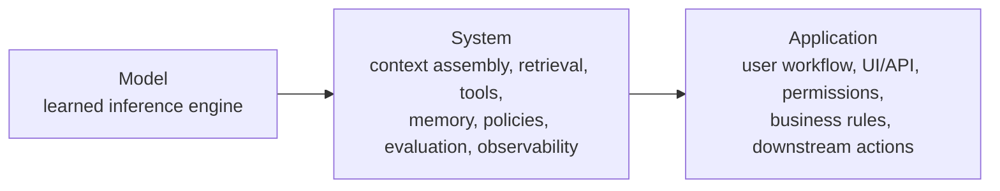

import AiSystemEvolutionPipeline from '@site/src/components/diagrams/AiSystemEvolutionPipeline';

<ModulePageHero slug="module-01-foundations" />

<CourseCallout title="Module arc">
  This opening module establishes the systems vocabulary used throughout the course. The central move is simple but
  foundational: we stop treating model quality as the whole problem and start reasoning about the architecture that
  surrounds a model, shapes its behavior, and determines whether it is useful in practice.
</CourseCallout>

<LearningObjectives
  title="What this module develops"
  items={[
    'Trace how AI engineering evolved from isolated predictive models to retrieval-augmented, tool-using, multimodal systems.',
    'Distinguish clearly between a model, the system built around it, and the application experienced by the end user.',
    'Reason about stateless and stateful designs, including where runtime state lives and what tradeoffs it introduces.',
    'Build a more precise mental model of reliability, control, observability, and memory in modern AI systems.',
  ]}
/>

## Module overview

Modern AI applications are rarely a single model invocation wrapped in a thin interface. Even a seemingly simple
assistant usually depends on prompt construction, retrieval, external tools, policies, caches, logging, evaluation
logic, and product-specific control flow. In other words, the visible behavior of an AI product emerges from a
**system**, not only from a model.

That distinction matters for engineering. Many failure modes that users attribute to "the AI" are actually caused by
missing context, weak retrieval, inconsistent state handling, poor orchestration, or inadequate monitoring. This course
therefore starts with systems thinking: before optimizing prompts or selecting models, we need a precise vocabulary for
how AI products are assembled and operated.

## Module structure

Module 01 is designed as the first shared vocabulary layer for the course. The overview introduces the historical and
conceptual framing; the two lectures develop a system-level view of AI applications; the lab asks students to apply that
view to a concrete assistant scenario.

| Page | Focus |
| --- | --- |
| **Lecture 1.1 — System Thinking for AI Applications** | How to explain AI behavior through components, interfaces, state, constraints, and feedback loops. |
| **Lecture 1.2 — Anatomy of an AI System** | The core layers of a modern LLM-centered system: application interface, orchestration, context, model, tools, state, validation, and evaluation. |
| **Lab 1 — Decomposing an AI Application** | A practical decomposition exercise for a course-materials assistant, including system boundaries, failure points, and observability. |

<ModuleTopics slug="module-01-foundations" title="Core topics in this module" />

## 1. Evolution of AI systems

The history of AI engineering can be read as a sequence of expanding system boundaries. The model remains important, but
the amount of surrounding machinery grows as tasks become more open-ended, interactive, and operationally demanding.

### From isolated predictive models to ML pipelines

Early production machine learning systems were often organized around a narrowly defined predictive task: credit risk
scoring, spam classification, churn prediction, or demand forecasting. A team would train a model on a curated dataset,
serve it in batch or behind an API, and evaluate it primarily through task-specific metrics such as accuracy, AUC, or
mean squared error.

As organizations adopted more ML, they discovered that the model was only one part of the operational burden. Feature
extraction, data validation, retraining schedules, model versioning, deployment, rollback, and monitoring all became
first-class concerns. This is the shift from **a model** to **an ML pipeline**. The engineering problem expands from
"fit a predictor" to "maintain a repeatable process that continuously produces trustworthy predictions."

### Deep learning widened the serving problem

Deep learning systems further increased the importance of infrastructure. Models became larger, training became more
expensive, hardware acceleration became central, and inputs increasingly included unstructured data such as images,
audio, and text. The deployment question was no longer just whether the model generalized, but also whether the team
could serve it at acceptable latency and cost while managing drift, failure recovery, and data freshness.

In this phase, AI systems became more tightly coupled to specialized runtimes, GPU scheduling, data pipelines, and
monitoring stacks. A vision classifier, for example, might still expose a single prediction endpoint, but the system
around it already involved preprocessing services, batching logic, artifact registries, and operational observability.

### LLM-centered systems changed the unit of design

Large language models changed the engineering unit again. Instead of mapping a fixed input schema to a fixed output
label, LLM-centered systems often rely on *in-context control*: instructions, examples, retrieved documents, tool
results, and conversation history all shape behavior at inference time. The design question shifts from "what weights do
we deploy?" to "what information and control signals do we assemble for this request?"

This matters because many core behaviors now depend on orchestration rather than finetuning. A help-desk assistant may
answer better not because the base model changed, but because the system improved document retrieval, inserted more
useful policy context, validated tool outputs, and filtered unsafe actions.

### Retrieval, tools, and multimodality extend the boundary again

The newest generation of AI systems is even less model-isolated. Many high-value systems combine:

- retrieval from private knowledge bases
- calls to tools, APIs, databases, or code execution environments
- multimodal inputs such as text plus images, documents, audio, or video
- persistent memory and user-specific state
- evaluation, guardrails, and workflow control around each step

At this point, an "AI application" is best understood as a coordinated software system in which the model is a central
but not sufficient component. The course is therefore about **systems for intelligence**, not only about intelligent
models.

<AiSystemEvolutionPipeline />

:::tip
The dominant engineering challenge usually moves outward over time. As models become more capable, the bottleneck often
becomes system design: context quality, workflow integration, reliability, governance, and evaluation.
:::

## 2. Model vs system vs application

One of the most common sources of confusion in AI projects is collapsing three different layers into one. The terms
*model*, *system*, and *application* are related, but they are not interchangeable.

| Layer | What it is | Typical components | Concrete example |
| --- | --- | --- | --- |
| **Model** | A learned function or inference engine that maps inputs to outputs. | Weights, tokenizer, runtime, decoding strategy, embeddings endpoint, classifier head. | A language model that generates text from a prompt. |
| **System** | The orchestration and control layer built around one or more models. | Prompt builder, retriever, tool router, cache, memory store, guardrails, logging, evaluation, retries. | A support-answering backend that retrieves policy docs, calls the model, validates citations, and logs traces. |
| **Application** | The end-user product or workflow that uses the system to deliver value. | UI, API contracts, permissions, business logic, analytics, downstream actions, human handoff. | A customer support portal where agents and users ask questions and trigger account operations. |

The distinction becomes clearer if we ask different questions at each layer:

- **Model question:** What mapping or generation capability does this learned component provide?
- **System question:** How do we assemble context, coordinate components, and control failure modes?
- **Application question:** What user workflow or business process does this enable?

Consider an internal research assistant for a pharmaceutical company:

- The **model** might be a frontier LLM used for summarization and reasoning over text.
- The **system** might chunk and index trial reports, retrieve relevant passages, add citation instructions, call a
  search API for recent literature, and store traces for audit.
- The **application** might be a secure analyst workspace where researchers compare studies, generate evidence briefs,
  and export structured summaries into a review workflow.

If the assistant gives an incorrect answer, the root cause could sit in any of these layers. The model may have limited
capability, but the system may also have retrieved the wrong documents, omitted key metadata, or failed to enforce a
citation policy. Treating all failures as "model failures" leads to poor interventions.



:::note
An application can change without changing the model, and a system can improve dramatically without changing the
application interface. This is one reason AI systems engineering emphasizes component boundaries: improvements are often
architectural, not merely parametric.
:::

## 3. Stateless vs stateful systems

State is one of the most consequential design choices in modern AI products because it determines how much of the past a
system can use, how difficult it is to reason about behavior, and how much operational complexity accumulates over time.

### What stateless means

A **stateless** service treats each request as self-contained. To process the request correctly, it should not need to
remember prior interactions from the same client. Any needed context must be supplied directly in the request or fetched
from external resources in a way that does not depend on hidden per-session memory.

Examples:

- a batch classifier that scores each record independently
- a translation endpoint that only uses the text provided in the current call
- a retrieval-based answer endpoint where all needed documents are freshly retrieved from a knowledge base for that one
  request

Stateless designs are easier to scale horizontally because any instance can usually serve any request. They are also
easier to replay, cache, and debug because behavior depends on explicit inputs rather than opaque session history.

### What stateful means

A **stateful** service depends on information that persists across requests. That information may represent conversation
history, user preferences, workflow progress, tool outputs from previous steps, or long-lived memory used to personalize
future responses.

Examples:

- a tutoring assistant that remembers the student's previous misconceptions within a study session
- a multi-step agent that stores intermediate plans, tool results, and pending tasks
- a customer support copilot that tracks case status, escalation history, and human approvals across turns

Statefulness is often necessary when tasks are iterative, personalized, or workflow-driven. However, it introduces more
failure modes: stale memory, race conditions, incorrect session association, hard-to-reproduce bugs, and complicated
rollback behavior.

### Where state can live

In AI systems, runtime state does **not** need to live "inside the model." In practice it can live in several places:

- the request payload itself, such as a supplied conversation transcript
- a relational or document database storing session records
- a cache holding temporary workflow artifacts
- a vector store or search index used as externalized long-term memory
- a task queue or workflow engine that tracks progress across steps
- application-layer logs and traces used for audit and debugging

The model weights are a form of learned, long-term parameter state, but they are not the same thing as operational
runtime state for a specific user or session.

:::warning
When teams say a chatbot "has memory," that memory almost always lives in surrounding infrastructure, not in the model in
the way application engineers sometimes imagine. If the storage, retrieval, or summarization policy is wrong, the system
will appear forgetful or inconsistent even when the model itself is unchanged.
:::

### Tradeoffs: reliability, context, memory, control, and observability

| Dimension | Stateless design | Stateful design |
| --- | --- | --- |
| **Context handling** | Context must be passed in or recomputed each time. | Context can accumulate across requests or workflow steps. |
| **Reliability** | Simpler failure surface and easier replay. | More ways to fail due to stale, missing, or corrupted state. |
| **Scalability** | Easier load balancing and horizontal scaling. | Requires session coordination or shared storage. |
| **Control** | Behavior is easier to reason about from explicit inputs. | Behavior depends on policy choices for writing, reading, and pruning state. |
| **Observability** | Inputs and outputs are often sufficient for debugging. | Traces must also capture state transitions and store interactions. |
| **User experience** | Can feel repetitive when prior context matters. | Supports continuity, personalization, and long-horizon tasks. |

A practical rule is to prefer **explicit state** over implicit state. If a system is stateful, engineers should be able
to answer at least four questions:

1. What state is written?
2. Where is it stored?
3. When is it retrieved?
4. How is it expired, summarized, or corrected?

If those answers are vague, the system will be difficult to operate safely.

### Example: making state explicit in code

The following sketch contrasts a stateless request with a stateful tutoring service. The key point is not the syntax; it
is the architectural boundary. In the stateful version, runtime memory is externalized in a store and deliberately read
and written by the system.

```python
from dataclasses import dataclass, field


def answer_stateless(question: str, retrieved_passages: list[str], model) -> str:
    """Every request contains the context it needs."""
    context = "\n\n".join(retrieved_passages)
    prompt = (
        "Answer using only the supplied context.\n\n"
        f"Context:\n{context}\n\n"
        f"Question: {question}"
    )
    return model.generate(prompt)


@dataclass
class SessionState:
    turns: list[tuple[str, str]] = field(default_factory=list)


class TutorService:
    def __init__(self, model, retriever, state_store):
        self.model = model
        self.retriever = retriever
        self.state_store = state_store

    def answer(self, session_id: str, question: str) -> str:
        state = self.state_store.load(session_id) or SessionState()
        passages = self.retriever.search(question)
        history = "\n".join(f"{role}: {text}" for role, text in state.turns[-4:])
        context = "\n\n".join(passages)

        prompt = (
            "You are a graduate-level AI tutor.\n"
            "Use the recent conversation and retrieved notes when relevant.\n\n"
            f"Recent history:\n{history}\n\n"
            f"Retrieved notes:\n{context}\n\n"
            f"Question: {question}"
        )

        answer = self.model.generate(prompt)
        state.turns.extend([("user", question), ("assistant", answer)])
        self.state_store.save(session_id, state)
        return answer
```

In the stateless case, reproducibility is straightforward: replay the request with the same passages and you should get
comparable behavior. In the stateful case, debugging also requires the session history, the retrieval results used at
that moment, and the storage policy that determined what history was retained.

<CourseCallout title="Design principle" variant="tip">
  Start with the smallest amount of state that the task genuinely requires. Add persistence only when it materially
  improves continuity, personalization, or workflow execution, and make every state transition observable.
</CourseCallout>

## Key takeaways

- AI engineering has evolved from isolated models toward systems that combine models with orchestration, retrieval,
  tools, memory, and operational controls.
- A **model** produces inferences, a **system** coordinates the components around those inferences, and an
  **application** embeds the system into a user-facing workflow.
- Most production failures in modern AI products are system failures, not purely model failures.
- Stateless systems are easier to scale and debug; stateful systems enable continuity and personalization but require
  disciplined storage, retrieval, and observability policies.
- In practice, useful AI design means deciding deliberately where intelligence ends and where system architecture begins.

## Further reading

- Sculley et al., *Hidden Technical Debt in Machine Learning Systems* (2015)
- Breck et al., *The ML Test Score: A Rubric for ML Production Readiness and Technical Debt Reduction* (2017)
- Bommasani et al., *On the Opportunities and Risks of Foundation Models* (2021)
- Lewis et al., *Retrieval-Augmented Generation for Knowledge-Intensive NLP Tasks* (2020)

<ResourceLinks
  title="Continue from here"
  items={[
    {label: 'Lecture 1.1 — System Thinking for AI Applications', href: '/docs/modules/module-01-foundations/lecture-1-1-system-thinking'},
    {label: 'Lecture 1.2 — Anatomy of an AI System', href: '/docs/modules/module-01-foundations/lecture-1-2-anatomy-ai-system'},
    {label: 'Lab 1 — Decomposing an AI Application', href: '/docs/modules/module-01-foundations/lab-1-decomposing-ai-application'},
  ]}
/>
