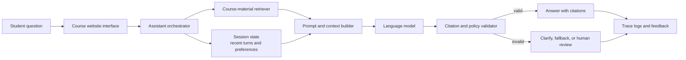

<PageHeader
  eyebrow="Lab 1"
  title="Decomposing an AI Application into System Components"
  description="In this lab, you will analyze an AI application as a system rather than as a single model call. The goal is to make components, boundaries, state, failure modes, and observability visible."
/>

<LearningObjectives
  title="Lab goals"
  items={[
    'Represent an AI assistant as a set of interacting system components.',
    'Distinguish application logic, model inference, orchestration, retrieval, tools, state, validation, and observability.',
    'Identify likely failure points and the evidence needed to debug them.',
    'Produce a concise system decomposition table and Mermaid diagram suitable for technical review.',
  ]}
/>

<CourseCallout title="Working assumption">
  You are not being asked to design the perfect architecture. You are being asked to make a defensible first
  decomposition: what parts exist, what each part is responsible for, where state lives, and how the team would know
  whether the system is behaving well.
</CourseCallout>

## Scenario

You are designing an AI assistant for a graduate course. The assistant helps students ask questions about course
materials, retrieves relevant lecture notes and readings, summarizes answers with citations, and can generate follow-up
study tasks. Students interact with it through a course website. Instructors want the assistant to be useful but also
auditable: when the assistant gives a questionable answer, the team should be able to inspect what happened.

Assume the system has access to:

- module overview pages, lecture notes, lab instructions, and selected readings
- a search index over course materials
- a language model capable of answering questions and generating study tasks
- optional tools for creating practice questions or adding study tasks to a student's workspace
- logs, traces, and feedback signals from student interactions

The assistant should not invent course policies, reveal private student data, or perform irreversible actions without
clear user confirmation.

## Student tasks

Complete the following tasks individually or in pairs. Keep your answers concrete. If you make an architectural
assumption, write it down.

### 1. Identify the application layer

Describe the user-facing workflow. Include who uses the assistant, where it appears, what the user can ask it to do, and
what permissions or product rules matter.

Questions to answer:

- Is the assistant used by students, instructors, teaching assistants, or all of them?
- What actions can the user initiate from the interface?
- What should the interface show when the system lacks sufficient evidence?
- Which actions require confirmation?

### 2. Identify the model layer

Describe what the model is responsible for and what it should not be responsible for. Avoid saying only "the model
answers questions." Specify the inference tasks.

Examples of model responsibilities:

- synthesize an answer from supplied course context
- rewrite retrieved notes into a concise explanation
- generate follow-up study tasks from validated material
- classify whether a question is about course content, logistics, or unsupported topics

Examples of responsibilities outside the model:

- deciding which private documents the user may access
- verifying that citations refer to retrieved sources
- writing long-term memory without a policy
- silently executing actions in external systems

### 3. Identify the system and orchestration layer

Explain how the system coordinates the request. Include routing, prompt selection, retrieval decisions, tool use,
fallbacks, and validation.

At minimum, identify:

- how the system decides whether retrieval is needed
- how it constructs the model prompt
- when tools may be called
- what happens if validation fails
- when the assistant should escalate to a human or ask the student for clarification

### 4. Identify retrieval and context sources

List the evidence sources the assistant can use. Distinguish static course materials from dynamic or user-specific
state.

Examples:

- lecture notes and module overview pages
- lab instructions and rubrics
- instructor-provided FAQs
- student-visible readings
- previous turns in the current conversation
- student-specific study progress, if allowed by policy

For each source, note whether it requires freshness checks, permission checks, or citation support.

### 5. Identify tools

List tools the assistant might use and whether each tool is read-only or has side effects.

Possible tools include:

- search course materials
- retrieve a document by ID
- generate practice questions
- create a study task
- look up assignment deadlines
- send a question to a teaching assistant queue

For any tool with side effects, state what confirmation, validation, or audit logging should be required.

### 6. Identify stateless and stateful parts

Separate what can be handled statelessly from what requires persistent state.

Examples of stateless parts:

- answering a single question using retrieved course materials supplied in the current request
- validating whether an answer contains citations to the retrieved sources
- classifying a question using only the current message

Examples of stateful parts:

- multi-turn conversation history
- student preferences or prior misconceptions
- saved study tasks
- instructor feedback on assistant answers
- long-term evaluation datasets built from production failures

For each stateful part, describe where the state lives and how it should be expired, corrected, or inspected.

### 7. Identify possible failure points

List at least six plausible failures. For each failure, identify the likely component and the evidence you would collect
to debug it.

Use the following categories as a starting point:

- poor context
- stale retrieval
- wrong tool call
- hidden or incorrect state
- invalid output format
- missing validation
- unclear user interface
- insufficient logging

### 8. Decide what should be logged or monitored

Define the observability signals needed for debugging and improvement. Include both technical and quality signals.

Useful signals may include:

- request ID, user role, and timestamp
- selected route or workflow branch
- retrieved document IDs, scores, and versions
- prompt template version
- model name and configuration
- tool calls, parameters, results, and side effects
- validation decisions and failure reasons
- latency, token usage, and estimated cost
- user feedback and instructor review outcomes

:::warning
Do not log private student content indiscriminately. Observability must be designed together with privacy, retention,
and access-control policies.
:::

### 9. Propose one improvement path

Choose one likely weakness in your initial design and propose a concrete improvement. For example:

- improve retrieval freshness with document version metadata
- add citation validation before returning answers
- add a "not enough evidence" fallback for unsupported questions
- add trace review for low-rated answers
- add explicit confirmation before creating study tasks

Explain what metric or evidence would show that the improvement worked.

## Deliverables

Submit the following:

1. A short system decomposition table with components, responsibilities, inputs, outputs, and failure risks.
2. One Mermaid diagram of your proposed system.
3. Short answers to the reflection questions below.

### Reflection questions

1. Which part of the system is most likely to cause an incorrect but plausible answer?
2. Which state should the assistant remember, and which state should it avoid remembering?
3. What would you log to debug a student complaint that the assistant cited the wrong lecture?
4. Which tool call would be most dangerous if executed incorrectly?
5. What is one improvement you would test before changing the base model?

## Partial example answer

The following is not a full solution. It shows the expected level of specificity.

| Component | Responsibility | Inputs | Outputs | Failure risk |
| --- | --- | --- | --- | --- |
| Application interface | Collect student question, display answer and citations, require confirmation for study-task creation. | Student message, user role, selected course/module. | Structured request to assistant backend; rendered answer. | Interface may hide uncertainty or make unsupported answers appear authoritative. |
| Retriever | Find relevant course materials that the student is allowed to access. | Search query, course filters, permission metadata. | Ranked passages with document IDs and versions. | Retrieves stale or irrelevant chunks; misses the correct lecture. |
| Prompt builder | Assemble instructions, question, retrieved context, and response format requirements. | User question, retrieved passages, prompt template version. | Model-ready prompt. | Prompt includes too much noise or omits citation rules. |
| Model | Draft grounded answer and possible study tasks. | Prompt with course context. | Draft answer in expected schema. | Produces plausible unsupported claims or malformed output. |
| Validator | Check citations, schema, and safety constraints. | Draft answer, retrieved documents, policy rules. | Accepted answer, rejected answer, or fallback. | Lets unsupported claims pass or rejects useful answers unnecessarily. |
| Trace logger | Record request path for debugging and evaluation. | Route, documents, prompt version, model config, validation result. | Trace ID and stored event sequence. | Missing intermediate evidence makes failures impossible to reproduce. |

An example system diagram might look like this:

Notice that this diagram does not claim the model "knows the course." The system gives the model retrieved evidence,
checks the output, and logs the path for later inspection.

## Optional extension: multimodal assistant

Extend your decomposition for a version of the assistant that accepts screenshots, diagrams, slides, or voice input.
Identify what changes.

Consider:

- screenshot preprocessing and OCR
- diagram interpretation or image-to-text summarization
- slide parsing and layout extraction
- speech-to-text transcription and confidence scores
- multimodal safety checks
- storage policies for uploaded media
- accessibility requirements for visual or audio inputs

Reflection prompt: Does multimodality mainly change the model layer, the retrieval/context layer, the application
interface, or all three? Defend your answer.

## Rubric

| Criterion | Excellent | Developing |
| --- | --- | --- |
| Correctness of decomposition | Components are distinct, responsibilities are accurate, and model responsibilities are not overstated. | Components are vague or collapse the system into "the model." |
| Clarity of system boundaries | Boundary choices are explicit and justified. Dependencies are identified. | Boundary choices are implicit or inconsistent. |
| Treatment of state and memory | Stateless and stateful parts are separated, with storage and observability policies. | State is mentioned but not located, scoped, or governed. |
| Quality of failure analysis | Failure points are tied to components and include useful debugging evidence. | Failures are generic or not connected to observable evidence. |
| Clarity of diagram | Diagram shows data/control flow and key components without unnecessary complexity. | Diagram omits major components or is too ambiguous to review. |

## Submission checklist

- Your decomposition table includes at least six components.
- Your Mermaid diagram renders and includes retrieval, model, validation, and observability.
- You identify at least three stateful elements and where they live.
- You describe at least six failure points with debugging evidence.
- Your improvement proposal includes a measurable signal.

<ResourceLinks
  title="Continue learning"
  items={[
    {label: 'Module 01 overview', href: '/docs/modules/module-01-foundations'},
    {label: 'Lecture 1.1 — System Thinking for AI Applications', href: '/docs/modules/module-01-foundations/lecture-1-1-system-thinking'},
    {label: 'Lecture 1.2 — Anatomy of an AI System', href: '/docs/modules/module-01-foundations/lecture-1-2-anatomy-ai-system'},
    {label: 'Module 02 — Prompt Engineering & Context Design', href: '/docs/modules/module-02-prompt-engineering-context-design'},
  ]}
/>
