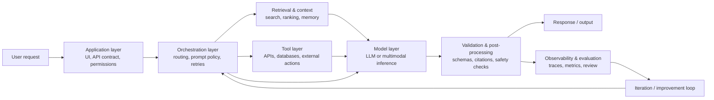

<PageHeader
  eyebrow="Lecture 1.1"
  title="System Thinking for AI Applications"
  description="This lecture develops the core analytical habit of the course: explain AI behavior in terms of interacting components, interfaces, state, policies, and feedback loops rather than attributing everything to the model alone."
/>

<LearningObjectives
  title="Lecture focus"
  items={[
    'Describe an AI application as a system with components, interfaces, state, constraints, and evaluation loops.',
    'Separate model capability from surrounding design choices such as retrieval, prompting, routing, guardrails, and user workflow.',
    'Diagnose common failure modes by locating them at the correct system layer.',
    'Use a simple architectural decomposition to reason about reliability, latency, cost, control, and observability.',
  ]}
/>

<CourseCallout title="Lecture framing">
  In classical software engineering, system thinking means analyzing behavior at the level of interacting parts rather
  than isolated functions. In AI engineering, that habit is even more important because the most visible failures are
  often produced by the composition around the model: poor context, missing tools, weak retrieval, hidden state, or
  misaligned product constraints.
</CourseCallout>

## Lecture overview

Students encountering modern AI applications for the first time often over-attribute behavior to the base model. If a
chat assistant answers incorrectly, the instinct is to ask whether the model is "good enough." Sometimes that is the
right question. Often it is not. The assistant may have received incomplete context, retrieved irrelevant documents,
ignored tool results, used stale state, or been forced into a brittle interaction pattern by the application layer.

System thinking is therefore a method of explanation. Instead of asking only, "What can the model do?", we ask:

- What components participate in the request?
- What information does each component add, remove, or transform?
- Where does state live?
- What constraints are enforced by policy or product requirements?
- How are failures observed, attributed, and corrected?

This perspective does not reduce the importance of the model. It places the model in its correct role: a powerful but
partial component inside a larger engineered system.

## 1. What system thinking means in AI

A useful working definition is:

> An AI system is a set of interacting computational components that transform inputs into useful outcomes under
> operational constraints.

That definition has four important implications.

### 1. Behavior is produced by composition

End-user behavior emerges from multiple layers acting together. A user sees one answer, one generated summary, or one
executed action, but that output may depend on many upstream decisions:

- how the input was normalized
- whether external knowledge was retrieved
- which prompt template was used
- whether a tool was called
- how the model output was validated
- what state from prior steps was injected
- what policy filters were applied before returning the result

For that reason, observing the output alone is not enough to understand the cause.

### 2. Components matter because boundaries matter

In system design, a boundary is where one component hands information to another. Boundaries determine what is visible,
what is hidden, what can fail independently, and what can be monitored. In AI systems, important boundaries often exist
between:

- the application and the orchestration layer
- the orchestrator and the model
- the model and external tools
- the request path and the state store
- offline evaluation and live production traffic

When those boundaries are vague, teams struggle to diagnose errors because everything is described as "the AI" instead
of in component terms.

### 3. Non-functional constraints shape architecture

AI applications are not judged only on semantic quality. They are also judged on latency, consistency, safety,
traceability, cost, and ease of iteration. These qualities rarely live inside the model alone. They are engineered
through architecture.

For example, the same model may appear:

- faster because the system caches retrieval results
- safer because the system inserts policy checks before tool execution
- more trustworthy because the system returns citations and trace data
- more expensive because the system over-fetches context or calls tools unnecessarily

### 4. Feedback loops are part of the system

A deployed AI system is not just the online request path. It also includes the loops that observe, evaluate, and improve
that path over time. Logging, trace collection, prompt iteration, offline evaluation, human review, and rollback plans
are part of the system because they influence future behavior and maintain operational quality.

:::tip
If a component changes what the system does tomorrow, not only what it does right now, it is part of the system even if
the end user never sees it directly.
:::

## 2. A canonical decomposition of an AI application

Many architectures are possible, but a useful first approximation is to separate a modern AI application into a small set
of recurring layers.



This diagram is intentionally simplified, but it illustrates two key points: the model is only one node in the request
path, and production systems also require feedback loops that improve future behavior.

### Application layer

This is where the user-facing workflow lives. It includes the interface, user permissions, business rules, and the
contract by which requests enter the system. An internal analyst tool, a customer support portal, and a coding assistant
may all use similar model capabilities while differing significantly at the application layer.

### Orchestration layer

This layer decides *how* the request should be handled. It may choose a prompt template, decide whether retrieval is
needed, call tools, manage retries, and select which outputs need validation. In LLM-centered systems, orchestration is
often the main site of engineering leverage.

### Retrieval and context layer

This layer determines what evidence or memory is made available to the model. In knowledge-intensive tasks, retrieval
quality can dominate answer quality. A strong model with weak retrieval often underperforms a weaker model with precise,
well-ranked context.

### Tool layer

Tools let a system move from passive text generation to grounded action. Examples include SQL queries, calendar APIs,
pricing services, search backends, or code execution sandboxes. Tool integration raises capability but also raises the
need for permissioning, validation, and auditability.

### Model layer

This is the inference engine: a language model, reranker, classifier, embedder, or some combination. It contributes
pattern recognition and generation capability, but it does not by itself define the complete system behavior.

### Post-processing and validation

This layer converts raw outputs into outputs that the application can trust. Examples include schema validation,
moderation, citation verification, deterministic business-rule checks, and confidence thresholds for escalation to a
human.

### Observability and evaluation

These functions span the whole stack. They record what the system did, how long it took, what it cost, which context was
used, and whether the outcome met quality expectations. Without this layer, iteration becomes anecdotal rather than
systematic.

## 3. Why model-centric explanations are often wrong

A model-centric explanation assigns most behavior to the learned weights. This is tempting because the model is the most
visible "AI" component. However, modern AI applications often fail in ways that are clearly systemic.

Consider a support assistant that answers with an outdated refund policy. Several explanations are possible:

1. The model lacks the relevant capability.
2. The retrieval layer fetched the wrong policy document.
3. The prompt failed to instruct the model to prefer the latest policy.
4. The state store injected stale conversation context from a different case.
5. The application displayed a draft answer that should have required review.

Only the first explanation is purely a model issue. The others are system issues. If the team says "we need a stronger
model" without checking the surrounding architecture, it may spend money without solving the real problem.

### Same model, different systems, different outcomes

This is one of the central empirical facts behind the course. The same base model can produce very different user-facing
quality depending on:

- prompt structure
- context selection
- retrieval precision and ranking
- tool availability
- output validation
- memory policy
- interaction design
- escalation and fallback logic

That is why system thinking is not merely conceptual. It changes how we allocate engineering effort.

:::note
In many production settings, the most valuable improvement is not "upgrade the model" but "improve the evidence,
interfaces, and controls around the model."
:::

## 4. System boundaries and failure analysis

A system boundary identifies what is inside the system we are designing and what is treated as an external dependency.
This matters because accountability, monitoring, and testing must usually respect those boundaries.

For example, imagine an AI coding assistant that uses:

- a language model for code generation
- a repository index for retrieval
- a linter and test runner as tools
- a UI for user interaction

A system-thinking analysis asks:

- Which components do we own directly?
- Which are external services with their own reliability profiles?
- Which interfaces are stable and versioned?
- What evidence do we need to capture to reproduce a failure?

### A practical diagnostic template

When an AI workflow misbehaves, the following sequence is often more useful than debating model quality in the abstract:

1. Reconstruct the exact request and response.
2. Inspect the prompt, retrieved context, tool calls, and validation outputs.
3. Determine what state was available at the time.
4. Locate the first component whose output was already wrong or insufficient.
5. Ask whether the issue is capability, interface, control flow, or data quality.

This pattern encourages causal reasoning instead of vague blame assignment.

## 5. Designing for reliability, latency, cost, and control

System thinking also helps because AI design is inherently multi-objective. We are not maximizing one scalar metric. We
are balancing several operational qualities at once.

### Reliability

Reliability in AI systems means more than uptime. It includes whether the system behaves predictably, uses the right
context, respects permissions, and fails safely. Reliability is improved through techniques such as deterministic
validation, fallbacks, retries, bounded tool access, and monitoring of retrieval quality or schema compliance.

### Latency

Every additional component in the request path adds time. Retrieval, tool calls, re-ranking, multi-step reasoning, and
validation can each improve quality but also increase latency. System design therefore involves deciding which steps are
worth performing synchronously and which can be cached, precomputed, or moved offline.

### Cost

In modern AI systems, cost is often driven by repeated context assembly, unnecessary model calls, long prompts, or
redundant tool use. A system-thinking approach looks for structural cost drivers instead of treating cost as a pure model
selection problem.

### Control

Control refers to how well engineers can constrain, inspect, and modify behavior. Systems with explicit prompts, clear
tool contracts, state policies, and validation layers are easier to control than systems that rely on hidden coupling or
informal assumptions.

### Observability

Observability is the ability to infer internal state from external signals such as logs, traces, metrics, and stored
artifacts. In AI systems, observability should capture not only latency and error counts, but also prompts, retrieved
documents, tool outputs, state lookups, and validation outcomes.

## 6. Example: a system-minded request handler

The code below is deliberately simple, but it illustrates the difference between "call a model" and "run a system." The
function captures retrieval, prompt construction, model invocation, validation, and trace logging as separate stages.

```python
from time import perf_counter


def answer_question(question: str, user_id: str, retriever, model, validator, tracer):
    start = perf_counter()

    tracer.record("request.received", {"user_id": user_id, "question": question})

    passages = retriever.search(question, top_k=4)
    tracer.record(
        "retrieval.completed",
        {
            "num_passages": len(passages),
            "sources": [p["source"] for p in passages],
        },
    )

    context = "\n\n".join(p["text"] for p in passages)
    prompt = (
        "Answer the question using the retrieved material when possible.\n"
        "If the evidence is insufficient, say so explicitly.\n\n"
        f"Question: {question}\n\n"
        f"Retrieved context:\n{context}"
    )

    raw_answer = model.generate(prompt)
    tracer.record("model.completed", {"chars": len(raw_answer)})

    checked_answer = validator.ensure_citations(raw_answer, passages)
    tracer.record("validation.completed", {"valid": checked_answer.is_valid})

    elapsed_ms = round((perf_counter() - start) * 1000, 1)
    tracer.record("request.finished", {"latency_ms": elapsed_ms})

    if not checked_answer.is_valid:
        return {
            "status": "needs_review",
            "answer": checked_answer.fallback_message,
            "latency_ms": elapsed_ms,
        }

    return {
        "status": "ok",
        "answer": checked_answer.text,
        "latency_ms": elapsed_ms,
        "sources": [p["source"] for p in passages],
    }
```

From a system-thinking perspective, several things are notable:

- retrieval is observable as a distinct step
- the model is not the final authority because validation can override it
- latency is measured across the whole workflow, not only the model call
- the returned status encodes control decisions for downstream application logic

In other words, the function is not just a wrapper. It defines how the system behaves under uncertainty.

:::warning
If a team logs only the final answer and not the intermediate context, tool outputs, and validation decisions, many AI
failures become practically impossible to reproduce. Lack of instrumentation is therefore not a minor inconvenience; it
is an architectural weakness.
:::

## 7. A checklist for applying system thinking

When evaluating or designing an AI application, the following checklist is often useful:

### Inputs and context

- What information is provided directly by the user?
- What information is retrieved externally?
- What context is persistent across requests?
- Which parts of the prompt are fixed, and which are dynamic?

### Components and interfaces

- What are the main components in the request path?
- What data contract does each component expect?
- Which failures can be detected locally, and which propagate silently?
- Which components are deterministic and which are probabilistic?

### Control and governance

- Where are permissions enforced?
- Where are unsafe or invalid outputs filtered?
- When is human review required?
- What policy assumptions are encoded in prompts versus code?

### Measurement and iteration

- What traces are captured for debugging?
- What quality metrics matter for this task?
- What costs and latencies are acceptable?
- How will we detect regression after making a change?

This checklist is intentionally practical. The goal is not to make every system complex. The goal is to make every
important dependency visible.

## In-class activity: decompose a real AI application

Choose one AI application and spend 15 minutes decomposing it as a system. Good candidates include an AI coding
assistant, a customer-support chatbot, a document QA assistant, or an AI tutor for course materials.

For the chosen application, identify:

- the **application layer**: who uses it, what workflow it supports, and what permissions matter
- the **orchestration layer**: how the request is routed, what prompts are assembled, and what control decisions happen
- the **retrieval/context layer**: what documents, memories, examples, or metadata are supplied to the model
- the **tool layer**: what external APIs, databases, code execution environments, or business systems may be called
- the **model layer**: what inference task the model performs and what outputs it produces
- the **validation layer**: what checks should happen before the user sees an answer or an action is taken
- the **observability signals**: what traces, metrics, logs, examples, or user feedback would help debug failures

At the end, compare two groups that chose different applications. The useful contrast is often not which model they
used, but which system responsibilities became visible once the application was decomposed.

## Check your understanding

1. Why might upgrading the model fail to fix a poor AI assistant?
2. What is one example of a system-level failure that is not primarily a model failure?
3. What evidence would you collect to debug a wrong answer from a document QA assistant?
4. Why is observability especially important in LLM-centered systems?
5. Which parts of the system can affect latency before the response reaches the user?

## Key takeaways

- System thinking explains AI behavior at the level of interacting components rather than attributing everything to the
  model.
- The request path of a modern AI application usually includes application logic, orchestration, retrieval, tools,
  validation, and observability in addition to the model.
- Many expensive mistakes come from solving the wrong problem, such as upgrading the model when retrieval, state, or
  validation is actually the limiting factor.
- Reliability, latency, cost, and control are architectural properties as much as they are model properties.
- A well-engineered AI system makes context, state, interfaces, and feedback loops explicit and inspectable.

## Further reading and next steps

- Sculley et al., *Hidden Technical Debt in Machine Learning Systems*
- Zaharia et al., *The Shift from Models to Compound AI Systems*
- Lewis et al., *Retrieval-Augmented Generation for Knowledge-Intensive NLP Tasks*

For the next step in this course, return to the module overview and compare this lecture's decomposition with later
modules on prompt engineering, retrieval, memory, and orchestration. Each later topic can be understood as a deeper study
of one part of the system map introduced here.

<ResourceLinks
  title="Continue learning"
  items={[
    {label: 'Module 01 overview', href: '/docs/modules/module-01-foundations'},
    {label: 'Lecture 1.2 — Anatomy of an AI System', href: '/docs/modules/module-01-foundations/lecture-1-2-anatomy-ai-system'},
    {label: 'Lab 1 — Decomposing an AI Application', href: '/docs/modules/module-01-foundations/lab-1-decomposing-ai-application'},
  ]}
/>
