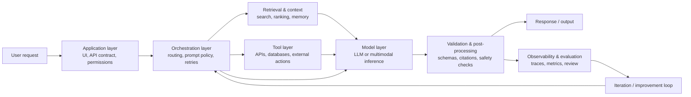

<PageHeader
  eyebrow="Lecture 1.2"
  title="Anatomy of an AI System: Models, Context, Tools, State, and Evaluation"
  description="This lecture develops a component-level view of modern AI systems so that students can reason precisely about how user requests become model inputs, tool calls, validated outputs, traces, and product behavior."
/>

<LearningObjectives
  title="Lecture focus"
  items={[
    'Identify the main components of a modern LLM-centered AI system and explain what each component contributes.',
    'Trace how data and control move from user request to response, including retrieval, tool use, validation, and logging.',
    'Draw clear system boundaries between the AI system, the surrounding product, infrastructure, and business workflow.',
    'Recognize common failure points such as stale context, hidden state, invalid output formats, and missing observability.',
  ]}
/>

<CourseCallout title="Why this lecture matters">
  Prompt engineering, retrieval-augmented generation, tool use, memory, agents, safety, evaluation, and production
  operations are often taught as separate topics. In practice, they are interdependent parts of one system. A component
  map gives us a shared vocabulary before we study each part in depth.
</CourseCallout>

## 1. Why anatomy matters

An AI application is easiest to misunderstand when it is described as a single call to a model. That description hides
the engineering work that determines whether the application is reliable, useful, safe, and maintainable. A graduate
student building an applied AI system needs to know not only which model is being used, but also how the system prepares
inputs, selects context, invokes tools, preserves state, validates outputs, and learns from production behavior.

The purpose of an architectural anatomy is to make those responsibilities explicit. Once the responsibilities are
visible, later course topics become easier to place:

- **Prompting** controls how task instructions, examples, constraints, and user inputs are represented for inference.
- **Retrieval-augmented generation** controls what external evidence enters the model context.
- **Structured outputs and tools** define contracts between probabilistic generation and deterministic software.
- **Memory and state** determine what the system carries across turns, sessions, or workflow steps.
- **Agents and orchestration** coordinate multi-step control flow and tool selection.
- **Evaluation and observability** determine whether the team can measure behavior, debug failures, and iterate safely.
- **Production systems** add latency, cost, security, deployment, and rollback constraints.

The central idea is that a model provides capability, but the surrounding system decides how that capability is used.

## 2. The core components of an AI system

The exact design depends on the product, but most modern LLM-centered systems contain some version of the following
components. Multimodal systems add additional encoders, parsers, or media-processing steps, but the same architectural
logic usually applies.

### Application interface

The application interface is the part of the product where requests enter and responses are shown. It may be a web UI,
chat interface, IDE extension, voice interface, API endpoint, or workflow embedded inside another product. It also
enforces product-level concerns such as authentication, user permissions, rate limits, and feature availability.

This layer matters because it shapes the task before the model ever sees it. A coding assistant in an IDE has access to
files, diagnostics, and user selections; a public chatbot may have only a text box; a clinical decision-support system
may need explicit consent, audit logging, and human review. The same model can behave very differently because the
application interface creates different inputs, permissions, and user expectations.

### Orchestration layer

The orchestration layer decides how a request should be handled. It may classify the request, choose a prompt template,
decide whether retrieval is necessary, call tools, enforce policies, manage retries, or route the request to a human.
In simple systems, orchestration may be a few lines of application code. In more complex systems, it may involve a
workflow engine, planner, router, or agent framework.

Good orchestration makes control flow explicit. It should be possible to answer questions such as: Which branch was
taken? Which tool was called? Why was retrieval used? Why was the output rejected or accepted?

### Prompt and context construction

Prompt and context construction is the process of assembling the model input. It includes system instructions, developer
instructions, task-specific templates, user input, examples, retrieved passages, tool results, memory summaries, and
format constraints.

This component is often where system behavior is most directly shaped. A well-designed context can make a smaller model
perform well on a narrow task, while a noisy or contradictory context can make a strong model fail. Context construction
therefore requires discipline: include the information needed for the task, preserve provenance where possible, and avoid
burying critical constraints under irrelevant text.

### Model inference layer

The model inference layer performs the learned computation. In an LLM-centered system, this is usually text generation,
but the layer may also include embedding models, rerankers, classifiers, vision-language models, speech models, or
specialized domain models.

The model layer contributes generalization and pattern completion, but it does not know the product boundary, the user's
permissions, the freshness of retrieved data, or the business consequences of an action unless the system represents
those constraints. Model selection is important, but it is only one part of system design.

### Retrieval layer

The retrieval layer supplies external knowledge or examples. It may search a document store, query a database, call a
semantic index, fetch user files, retrieve prior cases, or combine keyword search with embeddings and reranking.

Retrieval quality depends on more than vector similarity. Chunking strategy, metadata filters, freshness, permission
checks, ranking, deduplication, and citation handling all affect whether the model receives useful evidence. In many
knowledge-intensive systems, retrieval is the difference between a plausible answer and a grounded answer.

### Tool layer

Tools connect the AI system to external capabilities. A tool may query a SQL database, call a calendar API, run tests,
execute code, send an email draft, search the web, or calculate a price. Tool use is powerful because it lets the system
act on current, structured, or private information rather than relying only on model parameters.

Tools also introduce risk. A wrong tool call can leak data, mutate state incorrectly, increase latency, or cause
business harm. Tool contracts should therefore be explicit: inputs, outputs, permissions, side effects, failure modes,
and validation requirements should be defined in ordinary software terms.

### State and memory layer

State is information that persists beyond a single computation step. It can include conversation history, user
preferences, workflow progress, tool outputs, task plans, cached retrieval results, and long-term memories. State may
live in a database, cache, vector store, event log, browser storage, or workflow engine.

Stateful systems can provide continuity and personalization, but they are harder to debug than stateless systems. If a
wrong answer depends on hidden session memory, reproducing the failure requires the state snapshot and the policy that
decided what to read or write. For this reason, state should be explicit, scoped, observable, and easy to expire or
correct.

### Validation and safety layer

Validation converts raw model or tool outputs into outputs the application is willing to use. It may check JSON schemas,
verify citations, enforce business rules, detect unsafe content, constrain tool execution, require human approval, or
fall back to a safer response.

This layer is where probabilistic outputs meet deterministic requirements. A model may produce an answer that sounds
reasonable but violates a required format, cites nonexistent evidence, or proposes an unauthorized action. A production
system needs a way to detect and handle those cases.

### Observability and evaluation layer

Observability records what happened inside the system. Evaluation judges whether the behavior was good enough.
Together, they support debugging, regression testing, cost control, and product iteration.

Useful traces often include the user request, selected prompt template, retrieved documents, tool calls, model
configuration, output, validation result, latency, token usage, cost, feedback, and final application action. Without
these records, teams are left with anecdotes: "the assistant was bad yesterday." With traces, they can ask precise
questions: "Did the retriever fetch the wrong document, did the model ignore it, or did validation fail to catch the
mistake?"

:::note
In LLM-centered systems, observability is not just DevOps hygiene. It is part of the scientific method for improving the
system: capture evidence, inspect failures, change one component, and measure whether behavior improved.
:::

## 3. Data and control flow

A user request moves through both a data path and a control path. The data path carries the content being transformed:
the request, context, retrieved evidence, tool outputs, model response, and final answer. The control path decides what
steps should occur: whether retrieval is needed, which tools are allowed, whether validation passes, and whether the
system should retry, escalate, or return.



The diagram is intentionally generic. A real production system may have more branches, multiple model calls, streaming
responses, asynchronous jobs, human review queues, or multimodal preprocessing. The important habit is to preserve the
distinction between components and the contracts between them.

## 4. System boundaries

A system boundary tells us what we are designing, operating, and evaluating. Boundary choices are not merely diagrams;
they determine responsibility. If a component is inside the AI system boundary, the team should normally define its
interface, test it, monitor it, and understand how it contributes to failures. If a component is outside the boundary,
the system should still account for it as a dependency with latency, cost, availability, and policy constraints.

For an AI tutor that answers questions about course materials, the AI system boundary might include:

- the request handler that receives student questions
- the retriever that searches lecture notes and readings
- the prompt builder that formats context and instructions
- the model call
- the citation validator
- the trace logger and evaluation set

The surrounding product might include:

- the learning management system
- student account management
- analytics dashboards used by instructors
- gradebook workflows
- notification systems

The infrastructure might include:

- model provider APIs
- vector databases
- object storage
- CI/CD pipelines
- cloud networking and secrets management

The boundary can move depending on the assignment. In a product architecture review, the learning management system may
be in scope. In a lecture about retrieval quality, it may be a dependency. The key is to declare the boundary rather than
implicitly treating everything as "the AI."

<CourseCallout title="Boundary heuristic" variant="tip">
  Put a component inside the AI system boundary when changing it can directly change model inputs, tool decisions,
  memory, validation, or measured output quality. Treat it as a dependency when it mainly supplies infrastructure,
  identity, storage, or downstream workflow around the AI behavior.
</CourseCallout>

## 5. Common failure points

Component-level thinking helps because failures usually have a location. The following problems are common in early AI
systems and will recur throughout the course.

| Failure point | What it looks like | Likely system location |
| --- | --- | --- |
| Poor context | The answer is generic, misses key constraints, or ignores the user's actual task. | Prompt and context construction |
| Stale retrieval | The system answers from outdated policies, old documents, or superseded examples. | Retrieval layer and indexing pipeline |
| Wrong tool call | The assistant calls the wrong API, uses wrong parameters, or acts before approval. | Orchestration and tool layer |
| Hidden state | Behavior changes across turns but the reason is not visible in the trace. | State and memory layer |
| Invalid output format | The model produces prose when JSON is required, or returns fields the application cannot parse. | Model output and validation layer |
| Missing validation | Unsafe, unsupported, uncited, or policy-violating output reaches the user. | Validation and safety layer |
| No observability | The team cannot reproduce or attribute failures from production reports. | Logging, tracing, and evaluation layer |

These failure modes are not independent. Stale retrieval may produce poor context. Hidden state may cause a wrong tool
call. Missing validation may allow an invalid format to break the application. The practical goal is not to memorize a
taxonomy; it is to learn how to locate the first component whose output was already wrong.

## 6. Practical mini-example

The following simplified Python sketch shows a request path for a course-materials assistant. It separates retrieval,
prompt construction, model inference, validation, trace logging, and response construction. The functions are abstract on
purpose: the point is the system shape, not a specific SDK.

```python
def answer_course_question(user_id: str, question: str, services) -> dict:
    trace = services.tracer.start("course_qa", user_id=user_id)

    try:
        trace.add("request", {"question": question})

        documents = services.retriever.search(
            query=question,
            filters={"course": "Applied AI Systems Engineering"},
            top_k=5,
        )
        trace.add(
            "retrieval",
            {
                "document_ids": [doc.id for doc in documents],
                "scores": [doc.score for doc in documents],
            },
        )

        prompt = services.prompt_builder.render(
            template="course_qa_v1",
            variables={
                "question": question,
                "context": [doc.text for doc in documents],
                "instructions": "Answer with citations. Say when the evidence is insufficient.",
            },
        )
        trace.add("prompt", {"template": "course_qa_v1", "context_count": len(documents)})

        draft = services.model.generate(prompt, temperature=0.2)
        trace.add("model", {"output_chars": len(draft.text)})

        validation = services.validator.check_answer(
            answer=draft.text,
            sources=documents,
            required_schema="cited_answer",
        )
        trace.add("validation", {"passed": validation.passed, "issues": validation.issues})

        if not validation.passed:
            return {
                "status": "needs_review",
                "answer": "I could not produce a sufficiently grounded answer from the available material.",
                "trace_id": trace.id,
            }

        return {
            "status": "ok",
            "answer": validation.cleaned_answer,
            "citations": validation.citations,
            "trace_id": trace.id,
        }
    finally:
        services.tracer.finish(trace)
```

Several design decisions are visible in this small example:

- Retrieval is scoped to the course rather than the whole document store.
- The prompt template is versioned, which makes later evaluation and rollback possible.
- The model output is treated as a draft until validation passes.
- The response includes a trace identifier so production issues can be investigated.
- The system returns a controlled fallback instead of pretending to know when evidence is insufficient.

This is the kind of decomposition we will use throughout the course. Later modules will deepen individual parts, but
the first responsibility is to make the parts visible.

## 7. Key takeaways

- A modern AI system is a composition of application interface, orchestration, context construction, models, retrieval,
  tools, state, validation, and evaluation.
- Data flow and control flow are both important: the system transforms information while also deciding which operations
  should occur.
- System boundaries clarify responsibility, testing scope, observability, and failure attribution.
- Many practical failures are not caused by weak models alone; they arise from poor context, stale retrieval, wrong tool
  calls, hidden state, invalid formats, missing validation, or insufficient traces.
- A clean component map prepares us for the rest of the course: each later module studies one part of the anatomy in
  greater depth.

<ResourceLinks
  title="Continue learning"
  items={[
    {label: 'Lecture 1.1 — System Thinking for AI Applications', href: '/docs/modules/module-01-foundations/lecture-1-1-system-thinking'},
    {label: 'Lab 1 — Decomposing an AI Application', href: '/docs/modules/module-01-foundations/lab-1-decomposing-ai-application'},
    {label: 'Module 02 — Prompt Engineering & Context Design', href: '/docs/modules/module-02-prompt-engineering-context-design'},
  ]}
/>
