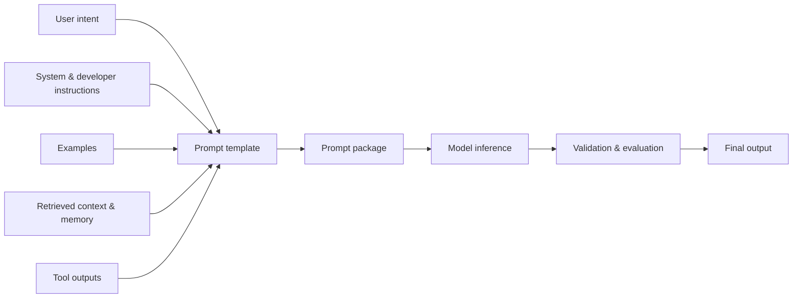

<ModulePageHero slug="module-02-prompt-engineering-context-design" />

<CourseCallout title="Module arc">
  Prompting is not only a writing technique. In LLM-centered systems, prompts are runtime interfaces between the
  application, the user, retrieved evidence, tool outputs, policies, and the model. This module teaches students how to
  design those interfaces deliberately and evaluate them rather than hoping that better wording alone will guarantee
  correct behavior.
</CourseCallout>

<LearningObjectives
  title="What this module develops"
  items={[
    'Design structured prompts that specify task, audience, constraints, context, output format, and evaluation criteria.',
    'Compare zero-shot, few-shot, and example-based prompting strategies for common applied AI tasks.',
    'Treat context engineering as a system-level design problem involving selection, ordering, compression, grounding, and validation.',
    'Evaluate prompt behavior with sample cases, failure analysis, and iteration instead of relying on subjective impressions.',
  ]}
/>

## Module overview

Module 02 moves from the systems vocabulary of Module 01 into one of the most important control surfaces in modern AI
applications: the information supplied to the model at inference time. A language model does not simply receive a
question and produce an answer in isolation. It receives a structured context that may include system instructions,
developer instructions, user input, retrieved documents, tool outputs, conversation history, examples, schemas, and
safety constraints.

Prompt engineering is the discipline of designing that structured input. Context design is the broader systems practice
of deciding what information belongs in the model's working context, where it comes from, how it is ordered, and how it
should be evaluated. Together, these practices shape reliability, latency, cost, grounding, format compliance, and user
experience.

This module is slightly larger than Module 01 because prompting and context design are prerequisites for almost every
later topic in the course: structured outputs, retrieval-augmented generation, agents, protocol-based tool use, safety,
evaluation, orchestration, and production monitoring.

## Why prompting is a systems concern

Ad hoc prompting often treats the prompt as a clever sentence written by a human. Production AI systems need a different
view. In a deployed assistant, the prompt is usually assembled by software from multiple sources:

- fixed system or developer instructions
- product-specific task templates
- the current user request
- retrieved documents or database records
- conversation history or memory summaries
- examples that define the desired pattern
- tool results and intermediate observations
- output schemas, safety policies, and validation rules

That assembled prompt becomes an interface contract. If it is ambiguous, contradictory, stale, too long, poorly ordered,
or missing task-critical evidence, the model may produce plausible but unreliable outputs. Better prompting can improve
behavior, but it does not remove the need for retrieval quality, validation, observability, and evaluation.

:::warning
A prompt can guide model behavior; it cannot guarantee correctness by itself. Prompts should be treated as versioned,
tested system artifacts, not as magic incantations.
:::

## Prerequisites

Students should be comfortable with the core ideas from Module 01:

- distinguishing a model from the system and application around it
- tracing a request through application, orchestration, retrieval, model, validation, and observability layers
- explaining stateless and stateful behavior
- recognizing that many AI failures are caused by context, interfaces, and controls rather than the base model alone

No specialized prompting framework is required. The examples use plain text, Markdown-style prompt blocks, and small
Python sketches.

## Module structure

| Page | Focus |
| --- | --- |
| **Lecture 2.1 — Prompt Structures and Instruction Design** | How structured prompts specify task, role, constraints, format, examples, and evaluation criteria. |
| **Lecture 2.2 — Few-Shot, Zero-Shot, and Example-Based Prompting** | How examples influence output consistency, task boundaries, style, and edge-case behavior. |
| **Lecture 2.3 — Context Engineering** | How systems select, order, compress, ground, and validate the information supplied to the model. |
| **Lab 2 — Designing, Testing, and Improving Prompts** | A practical prompt-design exercise for a course assistant using retrieved context and a simple evaluation rubric. |

<ModuleTopics slug="module-02-prompt-engineering-context-design" title="Core ideas in this module" />

## 1. Prompt structures

A prompt structure is the organized representation of a task for a model. It may include a role, task statement,
background context, constraints, examples, output format, and evaluation criteria. The structure matters because it
reduces ambiguity. Instead of asking the model to infer what kind of answer is wanted, the system specifies the intended
behavior.

For example, "Explain RAG" is underspecified. A structured prompt can specify the audience, purpose, grounding
requirements, length, format, and what to do when evidence is missing. That does not guarantee a perfect answer, but it
makes the desired behavior easier to evaluate and easier to improve.

## 2. Zero-shot vs few-shot prompting

In **zero-shot prompting**, the model receives instructions but no task-specific examples. This often works for familiar
tasks such as summarization, rewriting, classification with clear labels, or general explanation. It is simple and cheap,
which makes it a good starting point.

In **few-shot prompting**, the model also receives examples of the desired input-output pattern. Examples can communicate
formatting expectations, decision boundaries, style, edge cases, and domain conventions that are difficult to specify
fully in prose. Few-shot prompting is useful when zero-shot behavior is inconsistent, when labels are subtle, or when the
expected output format is strict.

Few-shot prompting is not automatically better. Poor examples can bias the model, contradict the instructions, consume
valuable context window space, or make the system overfit to a narrow pattern. Examples should be selected, versioned,
and evaluated like other system artifacts.

## 3. Context engineering

Context engineering is the design and management of all information supplied to the model at inference time. It includes
prompt wording, but it also includes source selection, retrieval, memory policy, tool outputs, conversation summaries,
schemas, and safety constraints.

The central tradeoff is that models have finite context windows and finite attention. More context can help when it adds
relevant evidence, but it can hurt when it introduces stale, irrelevant, contradictory, or low-priority information. Good
context engineering asks:

- What does the model need to know to perform this task?
- Which source is most trustworthy and current?
- What can be summarized or omitted?
- Which constraints must be placed close to the task?
- How will we validate whether the model used the context correctly?

This diagram is intentionally simple. Later modules will expand retrieval, tools, memory, and validation, but the key
point is already visible: prompt quality depends on the surrounding system that assembles and checks the model input.

## Check your understanding

1. Why is a production prompt better treated as a system artifact than as a one-off message?
2. When might a zero-shot prompt be preferable to a few-shot prompt?
3. What are two ways irrelevant context can harm model behavior?
4. Why should prompts and context-building rules be evaluated on held-out examples?
5. Which later modules depend directly on strong context engineering?

## Key takeaways

- Prompt engineering is the design of structured model inputs; context engineering is the broader system practice of
  managing all information supplied at inference time.
- Prompt structure clarifies task, audience, constraints, evidence, output format, and evaluation criteria.
- Few-shot examples can improve consistency but can also introduce bias, contradiction, or unnecessary token cost.
- More context is not always better; context must be selected, ordered, compressed, grounded, and validated.
- Prompts improve behavior only when paired with evaluation, monitoring, and system-level controls.

<ResourceLinks
  title="Continue from here"
  items={[
    {label: 'Lecture 2.1 — Prompt Structures and Instruction Design', href: '/docs/modules/module-02-prompt-engineering-context-design/lecture-2-1-prompt-structures-instruction-design'},
    {label: 'Lecture 2.2 — Few-Shot, Zero-Shot, and Example-Based Prompting', href: '/docs/modules/module-02-prompt-engineering-context-design/lecture-2-2-few-shot-zero-shot-example-prompting'},
    {label: 'Lecture 2.3 — Context Engineering', href: '/docs/modules/module-02-prompt-engineering-context-design/lecture-2-3-context-engineering'},
    {label: 'Lab 2 — Designing, Testing, and Improving Prompts', href: '/docs/modules/module-02-prompt-engineering-context-design/lab-2-designing-testing-improving-prompts'},
  ]}
/>
