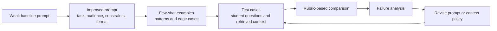

<PageHeader
  eyebrow="Lab 2"
  title="Designing, Testing, and Improving Prompts"
  description="In this lab, you will move from ad hoc prompting to systematic prompt design by building, comparing, and improving prompts for a course assistant."
/>

<LearningObjectives
  title="Lab goals"
  items={[
    'Design prompts that specify task, audience, constraints, context policy, and output structure.',
    'Compare zero-shot and few-shot prompting for the same LLM-centered assistant task.',
    'Define context-engineering rules for evidence inclusion, exclusion, missing evidence, and uncertainty.',
    'Evaluate prompt outputs with a simple rubric and use failures to propose an improvement.',
  ]}
/>

<CourseCallout title="Lab framing">
  The goal is not to find a perfect prompt in one attempt. The goal is to make prompt design testable: define the task,
  create a baseline, improve the structure, compare outputs on sample cases, identify failure modes, and propose the
  next iteration.
</CourseCallout>

## Scenario

An AI assistant helps students understand course material. Given a student question and a short piece of retrieved
course context, the assistant must produce a clear, grounded answer and suggest one follow-up study activity. The
assistant should be helpful, but it should not invent course facts or pretend the retrieved context supports claims that
are not present.

Your task is to design and test prompts for this assistant.

## Prompt iteration workflow

The lab follows a simple engineering loop: create a baseline, improve structure, test on cases, evaluate failures, and
revise the prompt or context policy.



## Sample data

Use the following sample questions and retrieved context snippets. You may add your own fourth case if time permits.

| Case | Student question | Retrieved context |
| --- | --- | --- |
| 1 | "Why is context engineering different from just writing a better prompt?" | "Context engineering is the design and management of all information supplied to the model at inference time. It includes prompt wording, retrieved documents, tool outputs, conversation history, examples, constraints, schemas, and safety policies." |
| 2 | "Should I always add few-shot examples to improve quality?" | "Few-shot prompting can improve consistency when examples clarify task pattern, edge cases, decision boundaries, or output format. It can also hurt when examples are misleading, contradictory, excessive, or not evaluated on held-out cases." |
| 3 | "Can the assistant remember everything from previous weeks?" | "Stateful systems may store conversation history, user preferences, workflow progress, or long-term memory. State should be explicit, scoped, observable, and governed by storage, expiration, and correction policies." |

## Student tasks

### 1. Write a weak baseline prompt

Start with a minimal prompt that a rushed developer might write. It should be intentionally underspecified but still
related to the scenario.

Example:

```text
Answer the student's question using the context.
```

Record why this prompt is weak. Consider missing audience, grounding policy, output structure, uncertainty handling, and
follow-up task requirements.

### 2. Improve the prompt structure

Write an improved prompt that includes:

- clear task
- intended audience
- constraints
- grounding requirement
- missing-evidence behavior
- output format
- follow-up study activity

Your improved prompt should make it possible to evaluate whether the assistant followed the instructions.

### 3. Create a zero-shot version

Create a zero-shot prompt that gives instructions but no examples. Use the same prompt across the three sample cases by
injecting `{student_question}` and `{retrieved_context}` as variables.

Template sketch:

```text
You are a graduate-level AI systems tutor.

Task:
Answer the student's question using only the retrieved course context.

Constraints:
- If the context is insufficient, say what is missing.
- Do not invent course policy or unsupported facts.
- Keep the answer concise and instructional.

Retrieved context:
{retrieved_context}

Student question:
{student_question}

Output format:
1. Answer
2. Evidence used
3. Follow-up study activity
```

You may revise this template, but preserve the grounding and output-structure requirements.

### 4. Create a few-shot version

Create a few-shot prompt with two or three examples. The examples should demonstrate the output format and at least one
edge case, such as insufficient evidence.

Example demonstration:

```text
Example 1
Question: "Why can retrieval quality affect the final answer?"
Context: "Retrieval quality determines what evidence is available to the model. Weak retrieval can cause a strong model
to answer from irrelevant, stale, or incomplete evidence."
Answer:
1. Answer: Retrieval quality affects the final answer because the model can only ground its response in the evidence the
system supplies. If retrieval is weak, the answer may be plausible but unsupported.
2. Evidence used: The context states that weak retrieval can supply irrelevant, stale, or incomplete evidence.
3. Follow-up study activity: Compare two retrieved snippets for the same question and decide which one better supports a
grounded answer.
```

Your examples should be concise. Do not add so many examples that the prompt becomes bloated.

### 5. Add context-engineering rules

Write a short context policy for the assistant. Include:

- what context to include
- what context to exclude
- how to handle missing evidence
- how to handle contradictory retrieved snippets
- whether conversation history should be included, summarized, or ignored
- what source metadata should be preserved

The policy can be written as bullets. It does not need to be executable code.

### 6. Define expected output structure

Define the output structure the assistant should produce. It may be prose, Markdown, or JSON-like text. It should be
easy for a human evaluator to inspect.

Minimum required fields:

- direct answer
- evidence used
- uncertainty or missing evidence
- follow-up study activity

### 7. Test prompts against sample questions

Run or simulate each prompt on the three sample cases:

- weak baseline prompt
- improved zero-shot prompt
- few-shot prompt

If you do not have access to a model during the lab, write expected outputs manually and focus on the evaluation logic.

### 8. Compare outputs with a simple rubric

Use the following table or create your own equivalent.

| Criterion | 1 - Weak | 2 - Adequate | 3 - Strong |
| --- | --- | --- | --- |
| Task clarity | Answer does not address the question. | Answer addresses the question but may be vague. | Answer directly addresses the question with appropriate scope. |
| Context use | Ignores or invents beyond the context. | Uses some context but misses key evidence. | Grounds claims in the supplied context. |
| Output structure | Missing required sections. | Mostly follows structure. | Fully follows structure and is easy to scan. |
| Uncertainty handling | Pretends to know unsupported facts. | Mentions uncertainty inconsistently. | Clearly states when evidence is insufficient. |
| Follow-up activity | Missing or generic. | Related but shallow. | Specific and useful for studying the concept. |

### 9. Identify failure modes

For each prompt version, identify at least one failure mode. Examples:

- prompt does not say what to do when evidence is missing
- answer is grounded but too verbose
- examples bias the model toward one style
- output format is difficult to parse
- context policy includes too much prior conversation
- follow-up activity is generic rather than tied to the question

### 10. Propose one improvement

Choose one improvement for the next iteration. It may involve prompt structure, example selection, context policy,
output schema, or evaluation. Explain what evidence would show that the improvement worked.

## Deliverables

Submit:

1. Baseline prompt.
2. Improved zero-shot prompt.
3. Few-shot prompt with two or three examples.
4. Context policy.
5. Comparison table for the three sample cases.
6. Short reflection on failure modes and one proposed improvement.

## Partial example answer

The following excerpt shows the expected level of specificity for a context policy.

| Context decision | Policy |
| --- | --- |
| Include | Top three retrieved snippets from current module pages, with source IDs and titles. |
| Exclude | Full lecture transcripts, unrelated modules, stale drafts, and private student records. |
| Missing evidence | State that the context is insufficient and ask for a more specific question or additional source. |
| Contradiction | Prefer newer or instructor-authored material; mention the conflict if both sources appear authoritative. |
| Conversation history | Include a short summary only when it affects the current question. Do not copy the full transcript by default. |
| Metadata | Preserve source ID, title, module number, and retrieval score for logging and citation checks. |

An improved output structure might look like this:

```text
Answer:
{one concise grounded explanation}

Evidence used:
- {source ID or short evidence description}

Uncertainty:
{state missing evidence or "No major uncertainty from the provided context."}

Follow-up study activity:
{one concrete activity tied to the question}
```

## Optional extension: multimodal prompt adaptation

Adapt your prompt for a version of the assistant where the student includes a screenshot of an error message or a
diagram from lecture slides.

Address:

- how the screenshot or diagram should be converted into context
- what visual details should be preserved
- how the assistant should handle low-confidence OCR or ambiguous diagram interpretation
- whether the output should cite the screenshot, retrieved text, or both
- what privacy or retention concerns appear when students upload images

Reflection prompt: Does the multimodal version require a different prompt, a different context policy, or both?

## Rubric

| Criterion | Excellent | Developing |
| --- | --- | --- |
| Clarity of task definition | Prompt clearly specifies task, audience, scope, and behavior under uncertainty. | Prompt is vague or leaves major task requirements implicit. |
| Quality of context use | Context policy selects relevant evidence and avoids unsupported claims. | Context use is ad hoc, excessive, or poorly grounded. |
| Grounding and evidence handling | Prompt requires evidence use and handles missing or contradictory evidence. | Prompt encourages plausible answers without source discipline. |
| Output structure | Output format is inspectable and supports evaluation. | Output format is missing, inconsistent, or difficult to compare. |
| Handling of uncertainty | Assistant is instructed to say when evidence is insufficient. | Assistant is likely to overclaim or invent details. |
| Evaluation quality | Comparison uses multiple cases, clear criteria, and failure analysis. | Evaluation relies on preference without a rubric or held-out cases. |

## Key takeaways

- Prompt design should begin with a baseline, not with the final polished prompt.
- Improved prompts make task, evidence, constraints, output structure, and uncertainty handling explicit.
- Few-shot examples are useful when they clarify behavior, but they must be concise and evaluated.
- Context policy is part of prompt quality because it decides what the model is allowed to use.
- Evaluation turns prompting from guesswork into an engineering loop.

<ResourceLinks
  title="Continue learning"
  items={[
    {label: 'Module 02 overview', href: '/docs/modules/module-02-prompt-engineering-context-design'},
    {label: 'Lecture 2.1 — Prompt Structures and Instruction Design', href: '/docs/modules/module-02-prompt-engineering-context-design/lecture-2-1-prompt-structures-instruction-design'},
    {label: 'Lecture 2.2 — Few-Shot, Zero-Shot, and Example-Based Prompting', href: '/docs/modules/module-02-prompt-engineering-context-design/lecture-2-2-few-shot-zero-shot-example-prompting'},
    {label: 'Lecture 2.3 — Context Engineering', href: '/docs/modules/module-02-prompt-engineering-context-design/lecture-2-3-context-engineering'},
    {label: 'Module 03 — Structured Outputs & Tool Integration', href: '/docs/modules/module-03-structured-outputs-tool-integration'},
  ]}
/>
