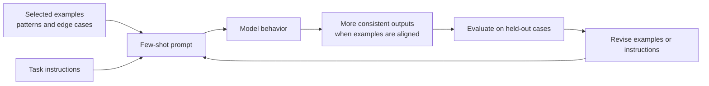

<PageHeader
  eyebrow="Lecture 2.2"
  title="Few-Shot, Zero-Shot, and Example-Based Prompting"
  description="This lecture explains how examples influence model behavior, when zero-shot prompting is sufficient, and how to design few-shot prompts without overfitting to a narrow set of cases."
/>

<LearningObjectives
  title="Lecture focus"
  items={[
    'Define zero-shot and few-shot prompting and explain when each strategy is appropriate.',
    'Use examples to communicate task pattern, style, edge cases, decision boundaries, and output format.',
    'Select examples that are representative, diverse, concise, correctly labeled, and aligned with the intended output.',
    'Identify failure modes caused by misleading, contradictory, excessive, or poorly evaluated examples.',
  ]}
/>

<CourseCallout title="Lecture framing">
  Examples are one of the most powerful ways to shape model behavior because they show the desired pattern rather than
  only describing it. But examples are also data. Like any data used in an AI system, they can be biased, stale,
  contradictory, too narrow, or poorly aligned with the cases seen in production.
</CourseCallout>

## 1. Zero-shot prompting

Zero-shot prompting means asking the model to perform a task using instructions but no task-specific examples. The model
relies on patterns learned during training and on the instructions supplied in the current prompt.

Zero-shot prompting often works well when:

- the task is common and easy to describe
- the label set or output format is simple
- the domain vocabulary is familiar
- the cost of adding examples is not justified
- the system needs to preserve context window space for retrieved evidence

For example, a zero-shot prompt may be enough for a straightforward request such as "Rewrite this paragraph in a more
formal tone" or "Classify this support ticket as billing, technical, or account access."

Zero-shot prompting tends to fail when the task has subtle decision boundaries, domain-specific conventions, unusual
formatting expectations, or edge cases that are hard to fully specify in prose. It can also be inconsistent when the
model's general prior conflicts with the application's intended behavior.

## 2. Few-shot prompting

Few-shot prompting adds a small number of examples to the prompt. Each example typically includes an input and the
desired output. The examples act as demonstrations of the task pattern.

Examples can communicate:

- **Task pattern:** what transformation should happen from input to output
- **Output style:** concise, detailed, formal, conversational, skeptical, or instructional
- **Edge cases:** how to handle ambiguous, incomplete, or unsupported inputs
- **Decision boundaries:** how labels differ when cases are close
- **Formatting expectations:** exact JSON fields, table columns, citations, or bullet structure

Few-shot prompting is not just about making the model "smarter." It is about narrowing the space of acceptable behavior.
The model already has many possible ways to answer. Examples show which pattern the system wants.



## 3. Example selection

Example selection is a design problem. Good examples are not simply the first cases a developer happens to write.

Strong examples should be:

- **Representative:** They reflect the kinds of inputs the system will actually see.
- **Diverse:** They cover different labels, styles, lengths, and difficulty levels.
- **Concise:** They show the pattern without consuming unnecessary context window space.
- **Correctly labeled:** The desired outputs must be accurate and consistent.
- **Aligned with expected output:** They use the same schema, tone, citation policy, and level of detail the system
  should produce.

Examples should also include at least some boundary cases. If a classifier must distinguish "content confusion" from
"technical issue," the prompt should include an example near that boundary, not only obvious cases.

:::tip
Treat prompt examples as a tiny training set inside the context window. They are not learned weights, but they still
shape behavior through data selection.
:::

## 4. Failure modes

Few-shot prompting can make behavior worse when examples are poorly designed.

| Failure mode | What happens | Practical response |
| --- | --- | --- |
| Misleading examples | The model learns the wrong pattern or overweights irrelevant details. | Replace examples with cases that isolate the intended signal. |
| Too many examples | The prompt becomes long, expensive, and harder for the model to use. | Keep the smallest set that improves held-out performance. |
| Contradictory examples | Similar inputs receive inconsistent outputs. | Audit labels and remove ambiguous or inconsistent demonstrations. |
| Format-only examples | The model imitates shape but not decision logic. | Add examples that clarify reasoning boundaries or evidence use. |
| Prompt overfitting | The prompt works on handpicked examples but fails on new cases. | Evaluate on held-out cases not shown in the prompt. |

These failures are easy to miss if a team tests only the examples included in the prompt. Evaluation must use cases the
model did not see in the prompt, just as model development uses held-out data.

## 5. Prompt examples: student feedback classification

Suppose a course team wants to classify student feedback into four categories:

- `technical issue`
- `content confusion`
- `administrative`
- `other`

### Zero-shot version

```text
Classify the student feedback into exactly one category:
- technical issue
- content confusion
- administrative
- other

Return only the category.

Feedback:
{feedback}
```

This zero-shot version may work for clear cases. For example, "The video will not load" is likely a technical issue, and
"When is the project due?" is likely administrative. But ambiguous cases may be inconsistent.

### Few-shot version

```text
Classify the student feedback into exactly one category:
- technical issue
- content confusion
- administrative
- other

Return only the category.

Examples:

Feedback: "The lecture video freezes at 12:30 and never resumes."
Category: technical issue

Feedback: "I understand embeddings, but I do not see why reranking changes the final answer."
Category: content confusion

Feedback: "Can I submit the lab one day late if I was sick?"
Category: administrative

Feedback: "The guest speaker example was interesting."
Category: other

Feedback:
{feedback}

Category:
```

The few-shot version is likely to be better when feedback is short, informal, or close to a decision boundary. It shows
that "not understanding a concept" is content confusion, while deadlines and submission policies are administrative.

If the task later needs a JSON output, the examples should also use JSON. The examples and expected output must agree.

## 6. Building few-shot prompts programmatically

In production systems, examples are often stored as data and inserted into a template. This makes it easier to update,
review, and evaluate examples separately from the surrounding instructions.

```python
EXAMPLES = [
    {
        "feedback": "The lecture video freezes at 12:30 and never resumes.",
        "category": "technical issue",
    },
    {
        "feedback": "I understand embeddings, but I do not see why reranking changes the final answer.",
        "category": "content confusion",
    },
    {
        "feedback": "Can I submit the lab one day late if I was sick?",
        "category": "administrative",
    },
]


def build_feedback_prompt(feedback: str, examples: list[dict[str, str]]) -> str:
    example_block = "\n\n".join(
        f'Feedback: "{item["feedback"]}"\nCategory: {item["category"]}'
        for item in examples
    )

    return f"""
Classify the student feedback into exactly one category:
- technical issue
- content confusion
- administrative
- other

Return only the category.

Examples:

{example_block}

Feedback:
"{feedback}"

Category:
""".strip()
```

This structure allows the team to version the examples, test different example sets, and inspect which example set was
used for a production classification.

## 7. Practical guidance

Use zero-shot prompting as the default baseline. It is simpler, cheaper, and easier to reason about. Add examples when
you observe a specific problem: inconsistent style, unstable labels, weak edge-case handling, or failure to follow a
format.

Rules of thumb:

- Start zero-shot and record baseline behavior.
- Add few-shot examples when behavior is inconsistent or boundaries are subtle.
- Use examples for edge cases, not only obvious cases.
- Keep examples concise and aligned with the output format.
- Evaluate on held-out examples that are not included in the prompt.
- Avoid bloated prompts; examples compete with retrieved context and user input for context window space.
- Remove examples that make behavior worse, even if they seem intuitively helpful.

## 8. Key takeaways

- Zero-shot prompting uses instructions without examples and is a strong baseline for many familiar tasks.
- Few-shot prompting uses examples to demonstrate task pattern, output style, edge cases, decision boundaries, and
  formatting.
- Example quality matters more than example quantity.
- Few-shot prompts can fail through misleading examples, contradiction, prompt bloat, and overfitting to a few cases.
- Example-based prompting should be evaluated systematically on held-out inputs.

## Check your understanding

1. When is zero-shot prompting likely to be sufficient?
2. What kinds of behavior can examples communicate better than prose instructions alone?
3. Why can too many examples reduce prompt quality?
4. What is one danger of evaluating a few-shot prompt only on the examples included in the prompt?
5. How would you choose examples for a classifier with subtle category boundaries?

<ResourceLinks
  title="Continue learning"
  items={[
    {label: 'Lecture 2.1 — Prompt Structures and Instruction Design', href: '/docs/modules/module-02-prompt-engineering-context-design/lecture-2-1-prompt-structures-instruction-design'},
    {label: 'Lecture 2.3 — Context Engineering', href: '/docs/modules/module-02-prompt-engineering-context-design/lecture-2-3-context-engineering'},
    {label: 'Lab 2 — Designing, Testing, and Improving Prompts', href: '/docs/modules/module-02-prompt-engineering-context-design/lab-2-designing-testing-improving-prompts'},
  ]}
/>
