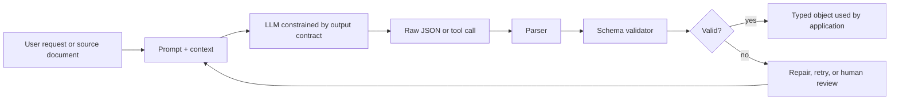
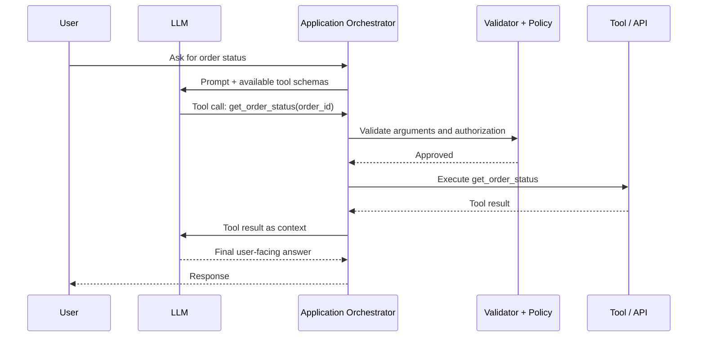
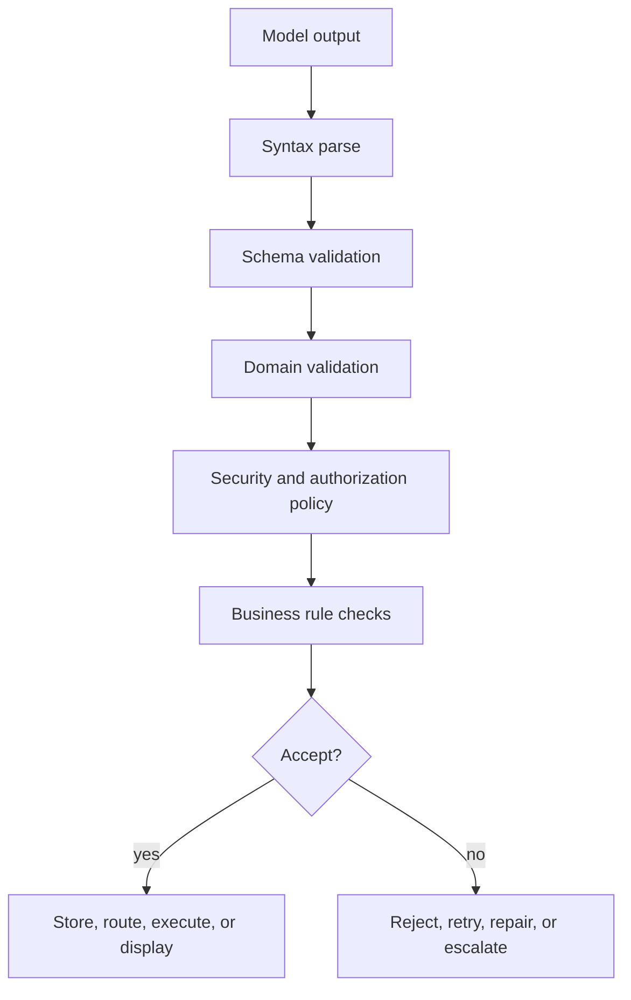
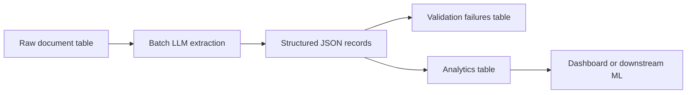
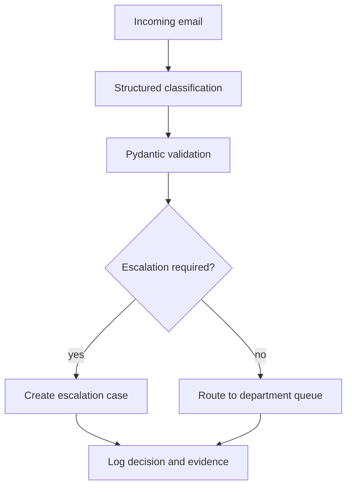

<ModulePageHero slug="module-03-structured-outputs-tool-integration" />

<CourseCallout title="Module arc">
  Structured-output engineering is the bridge from model behavior to application contracts. This module turns prompt
  design into typed data, tool interfaces, and validation pipelines that software can parse, audit, and safely execute.
</CourseCallout>

<LearningObjectives
  title="What this module develops"
  items={[
    'Explain the difference between plain JSON prompting, JSON mode, provider-native structured outputs, and tool/function calling.',
    'Design JSON schemas that are simple, explicit, and suitable for reliable LLM output generation.',
    'Use typed validation models, such as Pydantic models, to validate model outputs before they enter application logic.',
    'Describe the function-calling loop: tool definition, tool selection, argument generation, validation, execution, and tool-result handling.',
    'Identify safety and reliability risks in tool-using systems, including excessive permissions, invalid arguments, ambiguous tool selection, and unsafe autonomy.',
    'Implement a basic validation-and-retry pipeline for structured extraction or tool execution.',
  ]}
/>

## Module overview

Modern LLM applications rarely stop at natural-language chat. Production systems need model outputs that can be parsed, validated, stored, routed, audited, and used by other software. This module introduces the engineering layer that turns probabilistic model generations into deterministic application contracts: structured JSON outputs, function/tool calling, and validation pipelines.

The central idea is simple: an LLM may generate language, but an AI system must exchange **data**. A support assistant must return a ticket category, confidence score, escalation reason, and recommended action. A document-processing system must extract fields that match a database schema. An agent must call a tool using arguments that the application can validate before execution. Structured outputs and tool integration provide the bridge between language-model reasoning and conventional software engineering.

This module builds directly on Module 2, where prompts and context were designed for model behavior. Here, the focus shifts from *what we ask the model to do* to *how the application safely consumes and acts on the result*.

## Required background

Students should already understand:

- basic prompting concepts from Module 2
- JSON syntax and Python dictionaries
- API request/response thinking
- elementary Python functions and exception handling

Familiarity with JSON Schema and Pydantic is helpful but not required; both are introduced here.

---

<ModuleTopics slug="module-03-structured-outputs-tool-integration" title="Core topics in this module" />

## 1. Why structured outputs matter

A natural-language answer is useful for a human, but difficult for a program to consume reliably. Consider a model asked to classify a customer email:

> “This is probably a billing issue and should be escalated because the customer is angry.”

A human can interpret this sentence. A production system needs something more precise:

```json
{
  "category": "billing",
  "priority": "high",
  "requires_escalation": true,
  "customer_sentiment": "negative",
  "reason": "Customer reports unresolved billing error and expresses frustration."
}
```

The second form can be validated, stored in a database, displayed in a dashboard, or passed to another service. This is the difference between **conversation output** and **application output**.

Structured outputs are useful when the model output becomes input to another component, for example:

- extracting invoice fields from PDF text
- classifying support tickets
- creating normalized database records
- generating UI component descriptions
- producing batch analytics labels
- selecting a tool and passing arguments to it
- returning a final agent report with machine-readable status fields

:::info[Key idea]
Structured outputs do not make an LLM “deterministic” in the mathematical sense. They constrain the *shape* of the response so the system can reliably parse and validate it. The content can still be wrong, incomplete, biased, or unsupported by evidence. Validation checks structure and some semantics; evaluation checks task quality.
:::

---

## 2. The core pattern: contract-first LLM design

Structured output design should start with the receiving system, not with the prompt. Ask: **What exact object does the application need?** Then design the schema, validation rules, and failure handling around that object.



This flow gives us the three concepts that define the module:

| Concept | Role in the system | Example |
|---|---|---|
| JSON output | The model returns a machine-readable object | A support-ticket classification record |
| Function/tool calling | The model asks the application to run a named operation with arguments | `search_orders(customer_id="C123")` |
| Validation pipeline | The application checks syntax, schema, domain rules, and safety policy | Reject refund amounts above a threshold without human approval |

The best systems treat model output as **untrusted input**. This is the same principle used in secure web engineering: even if an upstream component is expected to behave correctly, downstream code validates before accepting the data.

---

## 3. JSON outputs: from formatting instruction to schema contract

### 3.1 Plain JSON prompting

The simplest approach is to write a prompt such as:

```text
Return only JSON with the fields: category, priority, reason.
```

This can work for prototypes, but it has common failure modes:

- the model may add explanatory text before or after the JSON
- required fields may be missing
- field names may drift, such as `urgency` instead of `priority`
- values may use inconsistent categories, such as `urgent`, `high priority`, and `P1`
- arrays or nested objects may be malformed
- the output may parse as JSON but still violate business rules

Plain prompting relies on model compliance. It does not give the API a formal schema to enforce.

### 3.2 JSON mode

Some model APIs provide a JSON mode that ensures the model emits syntactically valid JSON. This is stronger than plain prompting, because the application is less likely to encounter parsing failures. However, valid JSON is not the same as correct JSON.

For example, all three of these are valid JSON:

```json
{"priority": "high"}
```

```json
{"urgency": "high", "category": "billing"}
```

```json
["billing", "high", true]
```

Only the first might match the application’s expected object shape, and even it may be missing required fields. JSON mode helps with syntax. Schema-based structured outputs help with syntax **and** structure.

### 3.3 Schema-based structured outputs

Structured-output APIs allow the developer to supply a schema that describes the expected object. The provider then constrains or validates the model’s output against that schema. OpenAI describes Structured Outputs as a feature that makes responses adhere to a supplied JSON Schema, while distinguishing it from JSON mode, which only guarantees valid JSON rather than schema adherence [OpenAI Structured Outputs]. Claude’s documentation similarly describes structured outputs as a way to constrain responses to a specific schema and provide validated JSON for downstream processing [Claude Structured Outputs]. Databricks describes the same idea for batch structured generation and agent workflows, including JSON-schema-based response formats and tool calls [Databricks Structured Outputs].

A minimal schema for ticket classification might look like this:

```json
{
  "type": "object",
  "properties": {
    "category": {
      "type": "string",
      "enum": ["billing", "technical", "account", "other"],
      "description": "Primary reason for the customer contact."
    },
    "priority": {
      "type": "string",
      "enum": ["low", "medium", "high"]
    },
    "requires_escalation": {
      "type": "boolean"
    },
    "reason": {
      "type": "string",
      "description": "Short evidence-based justification."
    }
  },
  "required": ["category", "priority", "requires_escalation", "reason"],
  "additionalProperties": false
}
```

A schema is not only a technical artifact; it is a design decision. It defines what the application considers meaningful and what it ignores.

:::tip[Schema design rule]
Start with the smallest useful schema. Add fields only when the downstream application needs them. Deeply nested schemas, many optional fields, and vague descriptions increase complexity and can reduce reliability.
:::

---

## 4. JSON Schema essentials for LLM systems

JSON Schema is a vocabulary for describing and validating the structure of JSON documents. The JSON Schema validation specification describes schemas as a way to assert constraints on JSON instance data and determine whether the instance is valid against those constraints [JSON Schema Validation].

For LLM applications, the most important schema concepts are:

| Keyword | Purpose | LLM application use |
|---|---|---|
| `type` | Defines the expected data type | Ensure `priority` is a string and `requires_escalation` is a boolean |
| `properties` | Defines allowed object fields | Specify the shape of the extracted object |
| `required` | Lists fields that must appear | Prevent missing key application values |
| `enum` | Restricts values to a closed set | Prevent category drift such as `urgent` vs `high` |
| `items` | Defines the type of array elements | Validate lists of action items or extracted entities |
| `additionalProperties` | Controls unexpected fields | Reject hallucinated fields not used by the application |
| `description` | Explains field intent | Helps the model understand what each field means |

The `additionalProperties: false` setting is especially important in strict application contracts. The JSON Schema documentation explains that `additionalProperties` controls properties not listed in `properties` or matched by `patternProperties`; setting it to `false` disallows extra fields [JSON Schema Object Reference]. In LLM systems, this helps prevent the model from inventing fields that downstream code might accidentally trust.

### 4.1 Required fields and optionality

Different providers treat optional fields differently. Some strict structured-output modes require every field to be listed as required. In such cases, optionality is often represented by allowing `null` as a value:

```json
{
  "type": "object",
  "properties": {
    "customer_id": {
      "type": ["string", "null"],
      "description": "Known customer identifier, or null if not present in the source."
    }
  },
  "required": ["customer_id"],
  "additionalProperties": false
}
```

This distinction matters. A missing key and a key with a `null` value are not the same design choice:

- **Missing key** means the field is not part of the object.
- **`null` value** means the field is part of the object, but the value is unknown or not applicable.

For reliable pipelines, prefer explicit `null` values when the downstream code needs a stable object shape.

### 4.2 Descriptions are part of the interface

Field descriptions are not decorative. They guide the model’s interpretation of the schema. For example:

```json
"priority": {
  "type": "string",
  "enum": ["low", "medium", "high"],
  "description": "Use high only when the issue blocks the customer from using the product or involves legal, payment, or security risk."
}
```

This is better than:

```json
"priority": {"type": "string"}
```

The first schema embeds business meaning into the contract. The second only checks syntax.

---

## 5. Provider-native structured outputs

Different LLM platforms expose structured output features with different API names, but the conceptual pattern is similar: the developer provides a schema; the model response is constrained or validated against it.

### 5.1 OpenAI Structured Outputs

OpenAI supports structured outputs both for model responses and for function calling. The current OpenAI documentation distinguishes two major routes:

- use structured outputs through a response format when you want the model’s final answer to match a schema
- use structured outputs through function calling when the model should call tools or application functions

OpenAI recommends Structured Outputs over JSON mode when schema adherence is needed [OpenAI Structured Outputs]. In strict schemas, fields are commonly made required, and `additionalProperties: false` is used to prevent unexpected fields.

### 5.2 Claude Structured Outputs

Claude’s structured output documentation describes two complementary features:

- **JSON outputs** using an output format schema, for controlling what Claude says
- **strict tool use**, where tool names and tool inputs are validated against a schema

Claude’s documentation also highlights important operational considerations: schema compilation may add first-request latency, compiled grammar artifacts may be cached, and refusals or token limits can still result in outputs that do not match the expected schema [Claude Structured Outputs]. This is a valuable reminder that structured outputs reduce a class of failures but do not remove all failure handling from production systems.

### 5.3 LangChain structured output strategies

LangChain provides a higher-level abstraction over provider-specific structured output mechanisms. Its documentation describes two main strategies:

- `ProviderStrategy`, which uses provider-native structured output when the model provider supports it
- `ToolStrategy`, which uses tool calling to obtain structured data when native structured output is not available

LangChain can accept schema definitions such as Pydantic models, dataclasses, TypedDict classes, or JSON Schema dictionaries, then return a structured response in the agent state [LangChain Structured Output]. This is useful when building applications that may switch providers or models, but students should still understand the underlying provider behavior.

### 5.4 Databricks structured outputs for batch and agents

Databricks frames structured outputs around two production workflows:

- **batch structured generation**, where many documents or records are processed into structured JSON
- **agent workflows**, where function calling enables models to call external APIs or internal code

Its documentation emphasizes that constrained decoding can limit the set of possible next tokens so the generated output follows the required JSON structure [Databricks Structured Outputs]. This is especially relevant for large-scale extraction workloads where manual retries and parsing failures become expensive.

---

## 6. Under the hood: constrained decoding and validation

Structured-output systems are commonly implemented using some combination of:

1. **Prompt instructions** that explain the expected format.
2. **Constrained decoding** that restricts the tokens the model can generate at each step.
3. **Schema validation** after the response is produced.
4. **SDK parsing helpers** that convert JSON into typed objects.
5. **Retry or repair loops** when output is invalid or incomplete.

Constrained decoding is particularly important. Instead of allowing the model to choose any next token, the runtime masks tokens that would violate the grammar or schema at the current position. For example, if the model must begin a JSON object, tokens that cannot start an object are excluded. Databricks describes this as limiting the token set at each generation step based on the expected structural format [Databricks Structured Outputs]. Claude’s documentation similarly links structured outputs with constrained decoding and compiled grammar artifacts [Claude Structured Outputs].

However, constrained decoding is not magic. It can guarantee many structural properties, but it does not guarantee that extracted content is true. For example, a model can output:

```json
{
  "invoice_total": 950.00,
  "currency": "EUR"
}
```

This may match the schema perfectly while still being factually wrong if the invoice total was actually 590.00 EUR. Therefore, structured outputs should be combined with verification, tests, confidence thresholds, human review, or source-grounding checks when the task is important.

:::warning[Structured does not mean correct]
A valid schema tells you that the object has the expected shape. It does not prove the model interpreted the source correctly. Treat schema validation as one layer in a larger reliability pipeline.
:::

---

## 7. Working with typed models in Python

In Python systems, developers often define structured outputs using typed classes. Pydantic is a common choice because it can validate data, provide useful error details, and generate JSON Schema from Python type annotations. Pydantic’s documentation describes `ValidationError` as the exception raised when input data cannot be validated and provides structured error details such as location, message, and error type [Pydantic Error Handling].

Below is a minimal example for validating a support-ticket extraction.

```python
from enum import Enum
from pydantic import BaseModel, Field, ValidationError, field_validator


class Category(str, Enum):
    billing = "billing"
    technical = "technical"
    account = "account"
    other = "other"


class Priority(str, Enum):
    low = "low"
    medium = "medium"
    high = "high"


class TicketClassification(BaseModel):
    category: Category = Field(
        description="Primary reason for the customer contact."
    )
    priority: Priority = Field(
        description="Use high only for blocking, payment, legal, or security issues."
    )
    requires_escalation: bool
    reason: str = Field(
        min_length=10,
        description="Short evidence-based justification grounded in the message."
    )

    @field_validator("reason")
    @classmethod
    def reason_must_not_be_generic(cls, value: str) -> str:
        banned = {"not sure", "unclear", "unknown"}
        if value.strip().lower() in banned:
            raise ValueError("Reason must explain the decision, not just say it is unclear.")
        return value


# Example: output from an LLM or test fixture
model_output = {
    "category": "billing",
    "priority": "high",
    "requires_escalation": True,
    "reason": "The customer reports a duplicate charge and asks for urgent correction."
}

try:
    ticket = TicketClassification.model_validate(model_output)
    print(ticket.category)
    print(ticket.model_dump())
except ValidationError as error:
    print(error.errors())
```

This code separates three responsibilities:

- The **LLM** proposes values.
- The **schema/model** defines what values are allowed.
- The **validator** enforces additional domain rules.

### 7.1 Generating a JSON Schema from a Pydantic model

Typed models can often generate JSON Schema automatically:

```python
schema = TicketClassification.model_json_schema()
print(schema)
```

This schema can then be passed to a provider that accepts JSON Schema. In a real application, you should inspect the generated schema, because provider-specific structured-output features may support only a subset of JSON Schema.

### 7.2 Practical schema design checklist

Use this checklist before sending a schema to an LLM:

- Are field names short, stable, and meaningful?
- Does every field have a clear purpose in the downstream application?
- Are categories represented with `enum` where possible?
- Are required fields genuinely required by the application?
- Are optional values represented consistently, for example with `null`?
- Is nesting necessary, or can the schema be flattened?
- Are descriptions specific enough to guide model behavior?
- Are unexpected fields rejected with `additionalProperties: false` when strictness is required?
- Is the schema tested with real examples and adversarial examples?

---

## 8. Function calling and tool integration

Structured outputs control what the model returns. Function calling controls what the model asks the application to **do**.

A tool is an application-side capability exposed to the model through a schema. Examples include:

- `search_documents(query: str)`
- `get_customer_orders(customer_id: str)`
- `create_support_ticket(summary: str, priority: str)`
- `calculate_refund(order_id: str, reason: str)`
- `send_email(to: str, subject: str, body: str)`

The model does not execute the function directly. It emits a structured request to call a function. The application validates the request, decides whether execution is allowed, runs the code, and returns the tool result to the model or user.



OpenAI describes function calling as a way to connect models to external systems and data outside their training data; function tools are defined by JSON Schema and allow the model to pass data to application code [OpenAI Function Calling]. Claude’s strict tool use similarly validates tool names and inputs, and can be combined with JSON outputs when both tool calls and structured final responses are needed [Claude Structured Outputs].

### 8.1 The tool-calling loop

The basic loop has five steps:

1. **Define tools** using names, descriptions, and parameter schemas.
2. **Send tool definitions** with the user request and relevant context.
3. **Receive a tool call** from the model.
4. **Validate and execute** the tool call in application code.
5. **Return the tool result** to the model or directly to the user.

The model decides *what it wants to call*. The application decides *what is allowed to run*.

:::warning[Never delegate authorization to the model]
The LLM can propose a tool call, but it should not be the final authority on whether a tool call is safe, permitted, or appropriate. Authorization belongs in deterministic application code and downstream systems.
:::

---

## 9. Tool schemas as application interfaces

A tool schema should be treated like a public API contract. The model uses the schema to decide when and how to call the tool, and the application uses the same schema to validate the arguments.

Example tool definition:

```json
{
  "name": "search_orders",
  "description": "Search for customer orders by customer ID and optional status.",
  "parameters": {
    "type": "object",
    "properties": {
      "customer_id": {
        "type": "string",
        "description": "Internal customer identifier, for example CUST-1042."
      },
      "status": {
        "type": ["string", "null"],
        "enum": ["open", "shipped", "cancelled", "refunded", null],
        "description": "Optional order status filter. Use null if no filter is needed."
      }
    },
    "required": ["customer_id", "status"],
    "additionalProperties": false
  }
}
```

The description should tell the model when to use the tool. The parameter schema should define what arguments are legal. The application should still validate the arguments after receiving the tool call.

### 9.1 Tool design principles

| Principle | Explanation | Bad design | Better design |
|---|---|---|---|
| Minimum necessary capability | Expose only what the task requires | `run_sql(query)` | `get_order_status(order_id)` |
| Clear tool boundaries | Each tool should have one coherent purpose | `manage_customer()` | `get_customer_profile()`, `create_refund_request()` |
| Explicit parameter types | Avoid ambiguous free-text arguments | `input: string` | `order_id: string`, `reason: enum` |
| Safe defaults | Avoid irreversible actions without confirmation | `delete_file(path)` | `create_delete_request(file_id)` |
| Observable execution | Log tool name, arguments, result, and user/session | hidden execution | auditable tool-call trace |

The OWASP LLM Top 10 category “Excessive Agency” is directly relevant here. OWASP describes excessive agency as a risk where damaging actions can occur because an LLM system has excessive functionality, permissions, or autonomy [OWASP Excessive Agency]. This is why tool design must be governed by least privilege, approval workflows, and complete mediation in deterministic code.

---

## 10. Minimal tool dispatcher in Python

The following example shows a small application-side dispatcher. It demonstrates the separation between model output, validation, policy, and execution.

```python
from typing import Any, Callable, Literal
from pydantic import BaseModel, Field, ValidationError


class SearchOrdersArgs(BaseModel):
    customer_id: str = Field(pattern=r"^CUST-[0-9]+$")
    status: Literal["open", "shipped", "cancelled", "refunded"] | None = None


class RefundArgs(BaseModel):
    order_id: str = Field(pattern=r"^ORD-[0-9]+$")
    reason: Literal["duplicate_charge", "damaged_item", "late_delivery", "other"]
    amount_eur: float = Field(gt=0, le=500)


class ToolCall(BaseModel):
    name: Literal["search_orders", "create_refund_request"]
    arguments: dict[str, Any]


def search_orders(customer_id: str, status: str | None = None) -> dict[str, Any]:
    # In a real system this would query a database or service.
    return {
        "customer_id": customer_id,
        "orders": [
            {"order_id": "ORD-1001", "status": status or "shipped"},
            {"order_id": "ORD-1002", "status": status or "open"},
        ],
    }


def create_refund_request(order_id: str, reason: str, amount_eur: float) -> dict[str, Any]:
    # Safer design: create a request, do not directly send money.
    return {
        "refund_request_id": "RFND-9001",
        "order_id": order_id,
        "reason": reason,
        "amount_eur": amount_eur,
        "status": "pending_human_approval",
    }


TOOL_REGISTRY: dict[str, tuple[type[BaseModel], Callable[..., dict[str, Any]]]] = {
    "search_orders": (SearchOrdersArgs, search_orders),
    "create_refund_request": (RefundArgs, create_refund_request),
}


def dispatch_tool_call(raw_tool_call: dict[str, Any], user_role: str) -> dict[str, Any]:
    """Validate, authorize, and execute a model-proposed tool call."""

    try:
        tool_call = ToolCall.model_validate(raw_tool_call)
    except ValidationError as error:
        return {"ok": False, "error": "invalid_tool_call", "details": error.errors()}

    schema, function = TOOL_REGISTRY[tool_call.name]

    try:
        args = schema.model_validate(tool_call.arguments)
    except ValidationError as error:
        return {"ok": False, "error": "invalid_arguments", "details": error.errors()}

    # Policy check: the model cannot authorize itself.
    if tool_call.name == "create_refund_request" and user_role != "support_agent":
        return {"ok": False, "error": "permission_denied"}

    result = function(**args.model_dump())
    return {"ok": True, "tool": tool_call.name, "result": result}


# Example: a model-proposed tool call
raw_call = {
    "name": "create_refund_request",
    "arguments": {
        "order_id": "ORD-1001",
        "reason": "duplicate_charge",
        "amount_eur": 49.90,
    },
}

print(dispatch_tool_call(raw_call, user_role="support_agent"))
```

Notice what this code does **not** do:

- It does not execute arbitrary Python code suggested by the model.
- It does not trust the model’s arguments without validation.
- It does not let the model decide authorization.
- It does not issue money directly; it creates a refund request that requires approval.

These design choices are what transform a demo agent into an engineered system.

---

## 11. Validation pipelines

A validation pipeline is the deterministic path that every model output must pass before the application relies on it.



### 11.1 Layer 1: syntax parsing

The first layer checks whether the output can be parsed as JSON or as the provider’s structured object. Schema-based structured outputs reduce parsing failures, but applications should still handle incomplete outputs, refusals, token-limit cutoffs, or provider errors.

### 11.2 Layer 2: schema validation

Schema validation checks whether the object has the expected shape and types. This includes required fields, enums, arrays, nested objects, and rejected additional fields.

### 11.3 Layer 3: domain validation

Domain validation checks business-specific meaning. Examples:

- A refund amount must be positive and below a policy threshold.
- A meeting end time must be after the start time.
- A severity label must match the evidence in the incident description.
- A date must not be in the past for a future scheduling task.

These rules usually belong in application code, not only in the prompt.

### 11.4 Layer 4: security and authorization

Security validation checks what the user, model, and tool are allowed to do. Examples:

- Does the authenticated user have access to this customer account?
- Is this tool allowed in the current workflow?
- Is this action read-only or state-changing?
- Does this action require human approval?
- Are arguments sanitized before reaching a database, shell, browser, or external API?

### 11.5 Layer 5: observability and auditability

Structured outputs are valuable because they are easier to log and evaluate. A production system should record:

- schema version
- model name/version
- prompt or prompt template version
- input identifiers, respecting privacy rules
- raw model output where allowed
- validation result
- retry count
- tool name and validated arguments
- tool result or error
- final application decision

Observability turns silent model failures into debuggable engineering events.

---

## 12. Retry, repair, and escalation

Even with structured outputs, failures happen. A robust pipeline needs explicit failure handling.

### 12.1 Common failure modes

| Failure | Example | Possible response |
|---|---|---|
| Syntax error | malformed JSON | retry with provider structured mode or parser repair |
| Schema violation | missing required field | retry with validation error feedback |
| Unsupported enum | `urgent` instead of `high` | ask model to map to allowed enum or reject |
| Domain violation | refund amount exceeds limit | route for human review |
| Safety violation | model tries to call `delete_customer` | deny tool call and log event |
| Incomplete output | response cut off by token limit | retry with larger output limit or smaller schema |
| Low confidence | ambiguous source document | ask for clarification or escalate |

### 12.2 Validation-error feedback loop

When validation fails, the application can send a compact error message back to the model:

```text
Your previous output did not match the schema.
Validation errors:
- priority: expected one of low, medium, high
- reason: field required
Return a corrected JSON object only.
```

This can work, but retries should be bounded. Infinite repair loops can waste tokens and hide systematic failures.

A practical policy:

1. Try provider-native structured output.
2. Validate with application schema.
3. If validation fails, retry once with validation feedback.
4. If it fails again, escalate to human review or return a controlled error.

### 12.3 When not to retry

Do not automatically retry when:

- the model refuses for safety reasons
- the user lacks permission
- the requested action is destructive
- the source data is ambiguous and requires human judgment
- repeated retries would be expensive or time-sensitive

Retries are for recoverable formatting or interpretation errors, not for bypassing safety or authorization boundaries.

---

## 13. Structured outputs in batch workflows

Batch extraction is one of the strongest use cases for structured outputs. Suppose a company wants to process 200,000 customer emails and extract:

- topic
- product area
- sentiment
- urgency
- requested action
- evidence quote

Without structured outputs, the team may spend significant effort cleaning irregular text responses. With structured outputs, each row can produce a consistent JSON object that is easier to load into a table.



For batch workflows, schema design has direct cost and quality implications. Databricks recommends simpler, flatter schemas with clear parameter names and descriptions for better quality and performance [Databricks Structured Outputs]. In a large batch job, even a small failure rate can produce thousands of failed rows, so schema simplicity matters.

Batch workflow recommendations:

- Use stable schema versions.
- Store both validated outputs and validation failures.
- Include document IDs and source offsets for traceability.
- Avoid over-extracting fields that are not needed.
- Run a labeled evaluation sample before processing the full dataset.
- Monitor missing values and enum distributions after extraction.
- Keep a human-review path for ambiguous or high-impact records.

---

## 14. Structured outputs in agent workflows

In agent systems, structured outputs appear in two places:

1. **Tool calls**: the model emits structured arguments for a tool.
2. **Final response**: the model returns a structured summary of what happened.

Example final agent response:

```json
{
  "status": "completed",
  "tools_used": ["search_orders", "create_refund_request"],
  "user_visible_summary": "I found the duplicate charge and created a refund request for approval.",
  "requires_human_followup": true,
  "followup_reason": "Refund request must be approved by a support agent."
}
```

This is useful because the application can show the summary to the user, update a case-management system, and route follow-up tasks based on `requires_human_followup`.

Research on tool-using LLMs provides important context. ReAct showed that interleaving reasoning and actions can help language models interact with external sources and environments, improving interpretability and task performance in several benchmarks [ReAct]. Toolformer studied models learning when and how to call external APIs such as calculators, search systems, and calendars [Toolformer]. Gorilla focused on improving LLM API-call accuracy and reducing hallucinated API usage by connecting models with large API collections and retrieval [Gorilla]. These works motivate why tool use is powerful, but also why schemas, validation, and tool documentation are central to reliability.

---

## 15. Choosing between response schema and tool call

A common design question is whether a task should be implemented as structured response output or as a tool call.

Use a **structured response schema** when:

- the model’s job is to classify, extract, summarize, or transform information
- no external action is needed
- the application needs a typed object as the final result
- the output will be stored, evaluated, or passed to another deterministic component

Use a **tool call** when:

- the model needs information not present in the prompt
- the system must query a database or API
- the model needs to request an action from application code
- the action requires deterministic execution, authorization, or side effects

Use **both** when:

- the model must call tools during the workflow and return a structured final report
- the application needs machine-readable status after the agent completes
- the system needs audit fields such as tools used, confidence, and follow-up requirements

Example:

| User request | Better pattern | Why |
|---|---|---|
| “Classify this email.” | Structured response | No external action needed |
| “What is my order status?” | Tool call | Requires database/API lookup |
| “Find my delayed order and create a support case.” | Tool call + structured final response | Requires action and machine-readable completion status |
| “Extract invoice fields from these PDFs.” | Batch structured response | Large-scale extraction into tables |

---

## 16. Reliability and safety guidelines

### 16.1 Reliability guidelines

1. **Use provider-native structured outputs when available.** They are usually more reliable than prompt-only JSON formatting.
2. **Keep schemas small and explicit.** Avoid deeply nested objects unless the domain requires them.
3. **Use enums for controlled categories.** This reduces label drift.
4. **Validate again in application code.** Provider enforcement is not a replacement for local validation.
5. **Version schemas.** Schema changes can break downstream consumers.
6. **Log validation failures.** They reveal prompt, schema, model, and data problems.
7. **Evaluate with realistic examples.** Include edge cases and adversarial cases.
8. **Separate extraction from decision-making.** Extract facts first; apply policy in deterministic code.

### 16.2 Safety guidelines for tool integration

1. **Least privilege:** expose only the minimum tools and permissions needed.
2. **No open-ended execution:** avoid tools like `run_shell(command)` unless heavily sandboxed.
3. **Human approval for high-impact actions:** require confirmation for payments, deletion, external messages, or account changes.
4. **Allow-list tools:** do not let the model invent tool names.
5. **Validate all arguments:** use schemas and domain checks.
6. **Sanitize inputs:** especially before database queries, file paths, URLs, or shell operations.
7. **Use user-scoped credentials:** tools should act with the user’s permissions, not a broad service account, when appropriate.
8. **Make tool calls observable:** log who requested what, when, with which validated arguments.

---

## 17. Worked mini-example: support email router

### 17.1 Problem

A support inbox receives customer emails. The system should classify each email, decide whether escalation is needed, and optionally create a draft support action.

### 17.2 Structured output schema

```python
from enum import Enum
from pydantic import BaseModel, Field


class Department(str, Enum):
    billing = "billing"
    technical_support = "technical_support"
    account_management = "account_management"
    general = "general"


class SupportRoutingDecision(BaseModel):
    department: Department
    priority: str = Field(description="One of: low, medium, high")
    escalation_required: bool
    summary: str = Field(description="One-sentence summary of the issue")
    evidence: list[str] = Field(description="Short quotes or facts from the email")
    recommended_next_action: str
```

### 17.3 Prompt sketch

```text
You classify customer support emails for routing.
Use only evidence present in the email.
If the email mentions payment failure, duplicate charge, account lockout,
security concern, or legal complaint, consider escalation.
Return an object matching the provided schema.
```

### 17.4 Application pipeline



### 17.5 Engineering notes

- The model may classify and summarize, but routing rules should still be encoded in deterministic code.
- The evidence field should be checked to ensure it is grounded in the email.
- A high-priority decision should be auditable: the system should know why the decision happened.
- The schema should be versioned, for example `support_routing_decision_v1`.

---

## 18. Common mistakes

### Mistake 1: Asking for “valid JSON” but not providing a schema

Valid JSON is not enough. The application needs the correct fields, types, and allowed values.

### Mistake 2: Overly complex schemas

A schema with many nested optional fields can be hard for both humans and models. Start flat and add complexity only when required.

### Mistake 3: Treating schema validation as factual validation

A valid object can still contain wrong facts. Add source checks, evidence fields, or human review for important tasks.

### Mistake 4: Giving the model broad tools

A tool called `execute_command` or `run_sql` is much more dangerous than a narrow tool such as `get_invoice_status(invoice_id)`.

### Mistake 5: Letting the model decide permissions

The model can help interpret user intent, but deterministic authorization checks must decide whether an action is allowed.

### Mistake 6: No failure path

Every structured-output system needs a plan for invalid output, missing evidence, refusals, provider errors, and tool execution failures.

---

## 19. Lab: Build a structured extraction and tool-calling pipeline

### Goal

Build a small Python application that classifies support emails and optionally calls a mock tool to create a support case.

### Part A — Structured extraction

1. Create a Pydantic model named `SupportRoutingDecision`.
2. Include at least these fields:
   - `department`
   - `priority`
   - `escalation_required`
   - `summary`
   - `evidence`
   - `recommended_next_action`
3. Generate JSON Schema from the model.
4. Use an LLM structured-output feature or a mocked LLM response.
5. Validate the response with Pydantic.

### Part B — Tool integration

1. Define a tool named `create_support_case`.
2. The tool should accept:
   - `department`
   - `priority`
   - `summary`
   - `evidence`
3. Validate tool arguments before execution.
4. Do not create a case if validation fails.
5. Log the tool call and result.

### Part C — Failure handling

Add tests for:

- missing required fields
- unsupported priority values
- empty evidence list
- attempted call to an unknown tool
- escalation request by an unauthorized user

### Deliverable

Submit:

- the schema definition
- the validation code
- the tool dispatcher code
- at least five test cases
- a short reflection explaining what validation catches and what it does not catch

---

## 20. Key takeaways

- Structured outputs turn model generations into application-readable objects.
- JSON mode can ensure valid JSON, but schema-based structured outputs are needed for field-level adherence.
- JSON Schema defines the contract; typed validation models enforce the contract in application code.
- Function calling lets the model request external actions, but the application must validate, authorize, and execute the tool call.
- Constrained decoding reduces syntax and schema failures, but it does not guarantee factual correctness.
- Tool-using systems need least privilege, human approval for high-impact actions, and strong observability.
- A robust AI system treats model output as untrusted input and routes it through deterministic validation before use.

---

## Further reading

### Primary platform sources

1. Anthropic. “Structured outputs — Claude API Docs.” https://platform.claude.com/docs/en/build-with-claude/structured-outputs
2. OpenAI. “Structured model outputs.” https://developers.openai.com/api/docs/guides/structured-outputs
3. OpenAI. “Function calling.” https://developers.openai.com/api/docs/guides/function-calling
4. LangChain. “Structured output.” https://docs.langchain.com/oss/python/langchain/structured-output
5. Databricks. “Introducing Structured Outputs for Batch and Agent Workflows.” https://www.databricks.com/blog/introducing-structured-outputs-batch-and-agent-workflows

### Specifications and validation tools

6. JSON Schema. “JSON Schema Validation: A Vocabulary for Structural Validation of JSON.” https://json-schema.org/draft/2020-12/json-schema-validation
7. JSON Schema. “Understanding JSON Schema — Object.” https://json-schema.org/understanding-json-schema/reference/object
8. Pydantic. “Error Handling.” https://pydantic.dev/docs/validation/latest/errors/errors/
9. Pydantic. “Validators.” https://pydantic.dev/docs/validation/latest/concepts/validators/

### Research papers

10. Yao, S. et al. “ReAct: Synergizing Reasoning and Acting in Language Models.” ICLR 2023. https://openreview.net/forum?id=WE_vluYUL-X
11. Schick, T. et al. “Toolformer: Language Models Can Teach Themselves to Use Tools.” arXiv:2302.04761. https://arxiv.org/abs/2302.04761
12. Patil, S. G. et al. “Gorilla: Large Language Model Connected with Massive APIs.” arXiv:2305.15334. https://arxiv.org/abs/2305.15334

### Safety and system design

13. OWASP GenAI Security Project. “LLM06:2025 Excessive Agency.” https://genai.owasp.org/llmrisk/llm062025-excessive-agency/
14. Huyen, C. *AI Engineering: Building Applications with Foundation Models.* O’Reilly, 2025. Companion resources: https://github.com/chiphuyen/aie-book
15. Huyen, C. *Designing Machine Learning Systems: An Iterative Process for Production-Ready Applications.* O’Reilly, 2022.

---

## Suggested next step

In Module 4, students will study embeddings and semantic retrieval. Structured outputs remain important there: retrieval systems often return structured metadata, and RAG systems often need structured citations, extracted facts, confidence fields, and tool-call traces. The schema-first mindset introduced in this module will continue throughout RAG, agents, evaluation, safety, and production deployment.

<ResourceLinks
  title="Continue from here"
  items={[
    {label: 'Module 04 — Embeddings & Semantic Retrieval', href: '/docs/modules/module-04-embeddings-semantic-retrieval'},
    {label: 'Curriculum overview', href: '/docs/curriculum/overview'},
  ]}
/>
