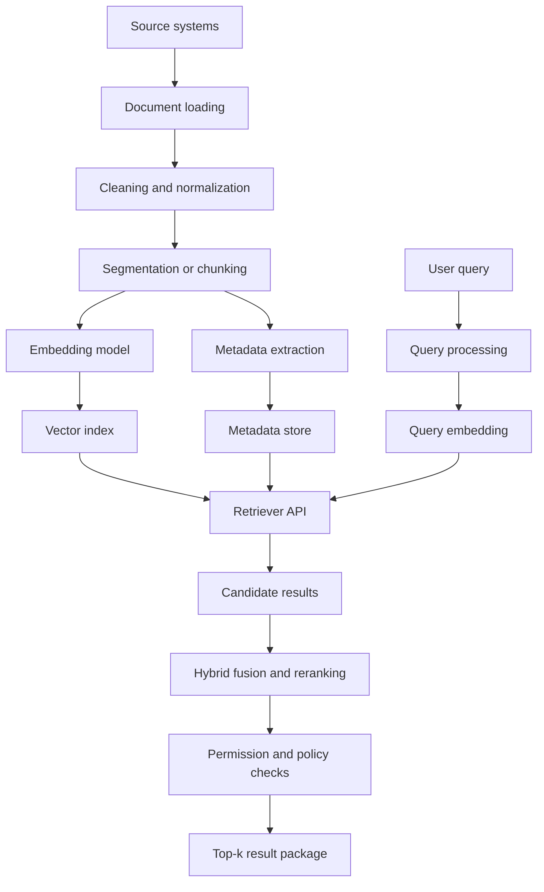
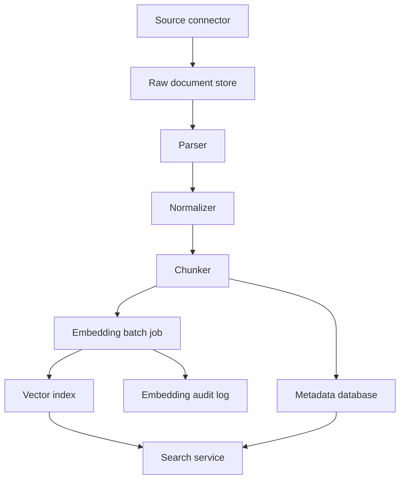

import {
  AccessControlRetrievalPipeline,
  ModuleFourRerankingPipeline,
  RerankingCascadePipeline,
} from '@site/src/components/diagrams/SemanticRetrievalPipelines';

<ModulePageHero slug="module-04-embeddings-semantic-retrieval" />

<CourseCallout title="Module arc">
  Retrieval begins with representation. This module explores how embeddings turn documents into searchable meaning
  spaces and how indexing choices shape recall, relevance, latency, cost, and production reliability.
</CourseCallout>

<LearningObjectives
  title="What this module develops"
  items={[
    'Explain what embeddings represent and why they enable semantic retrieval.',
    'Compare lexical, sparse neural, dense, multi-vector, multimodal, and hybrid retrieval methods.',
    'Choose an appropriate similarity metric and understand when cosine similarity, dot product, or Euclidean distance is appropriate.',
    'Describe the main stages of an embedding-based retrieval pipeline: document preparation, embedding, indexing, query embedding, candidate retrieval, filtering, reranking, and result packaging.',
    'Explain how vector databases and approximate nearest-neighbor indexes trade recall, latency, memory, and cost.',
    'Design retrieval systems that combine semantic search with metadata filters, access control, freshness requirements, deduplication, and observability.',
    'Evaluate retrieval systems using recall@k, precision@k, MRR, nDCG, latency, cost, and downstream task quality.',
    'Identify current trends including instruction-tuned, multilingual, multimodal, Matryoshka, contextual, late-chunking, and LLM-assisted retrieval.',
  ]}
/>

## Module overview

Embeddings and semantic retrieval are the retrieval foundation of modern LLM-powered systems. Before an application can perform retrieval-augmented generation, long-term memory, agent tool use, enterprise search, recommendation, duplicate detection, semantic routing, or multimodal document search, it needs a way to represent information so that related meanings are close to one another and searchable at scale.

This module introduces the engineering principles behind embedding-based retrieval. It starts from the classical information-retrieval problem, then develops dense vector representations, similarity metrics, vector indexing, hybrid retrieval, reranking, and evaluation. The goal is not only to understand how to call an embedding API, but to understand how retrieval quality, latency, cost, storage, freshness, and observability are shaped by design decisions.

The course curriculum defines this module around three core topics: **embeddings**, **vector databases**, and **similarity search**. This page expands those topics into a complete systems-engineering treatment for LLM applications.

:::info[Module focus]
Module 5 will study Retrieval-Augmented Generation in detail. Module 4 focuses on the retrieval layer itself: how documents become vectors, how indexes retrieve candidates, how results are ranked, and how retrieval quality is measured before an LLM ever generates an answer.
:::

## Required background

Students should already understand:

- basic Python programming
- JSON-style metadata records
- API request and response patterns
- prompt and context design from Module 2
- structured model outputs from Module 3

Helpful but not required:

- basic linear algebra: vectors, dot product, norms, matrix multiplication
- basic statistics and evaluation metrics
- familiarity with databases and indexing

---

<ModuleTopics slug="module-04-embeddings-semantic-retrieval" title="Core topics in this module" />

## 1. Why semantic retrieval matters in AI systems

Traditional search systems often rely on exact term overlap. A user asks for “refund policy,” and documents containing the words “refund” and “policy” rank highly. This works well when users and documents use the same vocabulary. It fails when the same idea is expressed with different words:

| User query | Relevant text may say |
|---|---|
| “How do I cancel my subscription?” | “You may terminate your plan from account settings.” |
| “Can employees work from home?” | “Remote work is permitted two days per week.” |
| “What happens if the model returns invalid JSON?” | “The parser rejects non-conforming outputs and triggers a retry.” |
| “Find slides about GPU memory” | “Activation checkpointing reduces VRAM pressure during training.” |

Semantic retrieval tries to retrieve by meaning rather than only by surface words. It represents queries and documents as vectors in a learned space. Items with related meaning should have nearby vectors, even if they do not share exact words.

For LLM applications, semantic retrieval is important because the model’s answer quality is often bounded by the quality of the context retrieved. A strong generator cannot reliably answer from missing, irrelevant, stale, or wrongly ranked context. Retrieval is therefore not a minor implementation detail; it is a core systems component.

Semantic retrieval supports many AI system patterns:

- **RAG**: retrieving relevant documents before generation
- **agent memory**: retrieving past interactions, facts, or user preferences
- **tool routing**: selecting the most relevant tool, API, workflow, or document collection
- **semantic caching**: reusing results for semantically similar requests
- **recommendation**: finding similar items, examples, cases, or products
- **classification**: assigning labels by nearest examples or prototype vectors
- **deduplication**: detecting near-duplicate tickets, documents, or embeddings
- **multimodal search**: searching text, screenshots, diagrams, tables, audio, and video in shared representation spaces

:::warning[Retrieval is not truth]
A retrieved passage is only evidence, not proof. Embedding similarity estimates semantic relatedness, but relatedness is not the same as correctness, authority, recency, or permission to use. Production retrieval must combine semantic ranking with metadata, provenance, policy checks, and evaluation.
:::

---

## 2. From lexical retrieval to neural retrieval

Information retrieval existed long before LLMs. Classical systems represented documents using terms and term weights. Modern semantic retrieval adds neural representations, but classical retrieval remains important and often competitive.

### 2.1 Lexical retrieval

Lexical retrieval scores documents according to word or token overlap with the query. Examples include Boolean retrieval, TF-IDF, BM25, and field-aware variants such as BM25F.

BM25 is still a strong baseline because it handles exact terms, rare identifiers, names, codes, product numbers, error messages, and legal or technical terminology. Dense embeddings sometimes underperform on these cases because they smooth meaning into a fixed-size vector and may fail to preserve exact token identity.

Lexical retrieval is especially useful when queries contain:

- exact product names
- error codes
- legal clauses
- identifiers such as invoice numbers or ticket IDs
- function names or API paths
- rare domain terminology
- spelling variations that are handled by analyzers

### 2.2 Dense retrieval

Dense retrieval maps queries and documents into continuous vectors. A model encodes the query, another model or the same model encodes each document chunk, and nearest-neighbor search returns the closest vectors.

Dense retrieval became influential because dual-encoder models can precompute document vectors offline and compare query/document vectors efficiently at runtime. Dense Passage Retrieval (DPR), for example, showed that dense dual encoders could outperform a strong BM25 baseline on several open-domain QA retrieval tasks.

### 2.3 Sparse neural retrieval

Sparse neural retrieval models learn sparse vector representations, often over vocabulary-sized spaces. SPLADE is a major example. These methods combine neural expansion with the efficiency and interpretability advantages of sparse inverted indexes. They can preserve some lexical behavior while also learning expansion terms.

### 2.4 Late-interaction retrieval

Single-vector dense embeddings compress a whole text into one vector. Late-interaction models such as ColBERT keep token-level embeddings and compare query tokens with document tokens using a lightweight interaction mechanism. This improves fine-grained matching, but uses more storage and computation than single-vector retrieval.

### 2.5 Reranking

Many production systems use a two-stage retrieval pipeline:

1. A fast first-stage retriever returns tens or hundreds of candidates.
2. A slower reranker deeply evaluates the query-candidate pairs and chooses the final top results.

First-stage retrieval optimizes recall and latency. Reranking optimizes precision and answer relevance.

<ModuleFourRerankingPipeline />

:::tip[Practical lesson]
Do not treat dense retrieval as a replacement for all search. Strong systems often combine dense similarity, lexical matching, metadata filtering, and reranking.
:::

---

## 3. What an embedding is

An embedding is a learned numerical representation of an object. In this module, the object is usually text, but it can also be an image, table, code file, audio segment, video clip, user profile, product, API tool, or conversation state.

A text embedding model maps text to a vector:

$$
\mathrm{embed}(\text{"How do I reset my password?"}) \rightarrow [0.018, -0.043, 0.112, \ldots, -0.027]
$$

The exact numbers are not interpretable individually. The useful information is in the geometry of the vector space. Texts that are semantically similar should appear close to each other according to a similarity function.

### 3.1 Distributional semantics

The conceptual foundation of embeddings is distributional semantics: linguistic items that occur in similar contexts tend to have related meanings. Modern transformer-based embeddings extend this idea using large-scale pretraining and contrastive learning.

Older embeddings such as word2vec and GloVe produced one vector per word type. Modern sentence and document embeddings are contextual: the representation can depend on the surrounding text, task instruction, and input type.

### 3.2 Embedding dimensions

Embedding dimensionality varies by model. Higher-dimensional vectors can represent more information, but they increase storage, memory bandwidth, and search cost. A corpus of 10 million vectors at 1536 dimensions stored as 32-bit floats requires roughly:

$$
10{,}000{,}000 \times 1536 \times 4\ \mathrm{bytes} \approx 61.4\ \mathrm{GB}
$$

This is only the raw vector matrix. Index structures, metadata, replicas, and operational overhead increase the real storage footprint.

Recent embedding systems increasingly support flexible output dimensions. Matryoshka Representation Learning trains representations so that prefixes of the vector can remain useful at smaller dimensions. This enables a system to trade quality for cost by using fewer dimensions without training a separate model.

### 3.3 What embeddings capture

Embeddings can capture:

- topical similarity
- paraphrase similarity
- conceptual relatedness
- task-specific relevance
- language-agnostic meaning in multilingual models
- image-text alignment in multimodal models
- code semantics in code-trained embedding models
- document layout and visual semantics in multimodal document embeddings

They may fail to capture:

- exact negation
- numerical constraints
- strict chronology
- rare identifiers
- fine-grained legal obligations
- authority or trustworthiness
- whether a passage actually answers the question
- whether the user is allowed to see the passage

This is why retrieval systems often need reranking, filtering, provenance, and evaluation beyond nearest-neighbor similarity.

---

## 4. Embedding model families

The embedding model chosen for a system determines much of its retrieval behavior. There is no universal best model for every task. Benchmark results, domain evaluation, cost, latency, multilingual coverage, privacy constraints, and deployment model all matter.

### 4.1 Static word embeddings

Static word embeddings assign one vector to each word type. They were foundational for neural NLP but are limited because a word has the same vector regardless of context.

Example limitation:

```text
"bank" in "river bank" and "bank account" receives the same type-level embedding.
```

Static word embeddings are useful historically and conceptually, but modern semantic retrieval usually uses sentence, passage, or multimodal embeddings.

### 4.2 Sentence and passage embeddings

Sentence-BERT modified BERT with siamese and triplet network structures to produce sentence embeddings that can be compared with cosine similarity. This made large-scale semantic similarity search practical compared with pairwise BERT scoring.

Sentence/passage embeddings are the standard building block for many RAG systems. A passage is embedded once, stored, and compared to a query embedding at search time.

### 4.3 Dual-encoder dense retrievers

A dual encoder uses separate or shared encoders for queries and documents:

$$
\begin{aligned}
\mathrm{query\_encoder}(\mathrm{query}) &\rightarrow \mathrm{q\_vector} \\
\mathrm{document\_encoder}(\mathrm{document}) &\rightarrow \mathrm{d\_vector} \\
\mathrm{score}(\mathrm{query}, \mathrm{document}) &= \mathrm{similarity}(\mathrm{q\_vector}, \mathrm{d\_vector})
\end{aligned}
$$

The advantage is that document vectors can be precomputed. The disadvantage is that the query and document do not interact token-by-token during first-stage retrieval. This can reduce precision for complex questions.

### 4.4 Instruction-tuned embeddings

Modern embedding models often accept task instructions or distinguish between query and document input modes. For example:

```text
Query instruction: "Represent this question for retrieving relevant documentation: ..."
Document instruction: "Represent this documentation passage for retrieval: ..."
```

Instruction tuning helps one model support multiple embedding tasks, such as retrieval, clustering, classification, semantic textual similarity, and reranking support.

### 4.5 Multilingual embeddings

Multilingual embeddings map texts from multiple languages into a shared or aligned space. This enables cross-lingual retrieval:

```text
Finnish query: "Miten oleskelulupahakemuksen käsittelyaikaa voi seurata?"
English document: "Applicants can track residence permit processing status online."
```

Multilingual retrieval is important for European enterprise systems, public administration, cross-border education, and global customer support. However, multilingual benchmark averages can hide poor performance for low-resource languages or specialized domains. Always evaluate in the languages and genres your users actually use.

### 4.6 Domain-specific embeddings

Domain-specific embeddings are trained or fine-tuned for specialized corpora, such as medicine, law, finance, software engineering, patents, scholarly articles, or customer support. They can outperform general models when domain terminology and relevance judgments differ from general web text.

Tradeoff: domain-specific models can be less robust outside the domain and may require maintenance when terminology changes.

### 4.7 Code embeddings

Code retrieval has special requirements. Exact symbols, dependencies, function signatures, API names, and repository structure matter. A good code embedding model must represent both natural-language intent and program structure.

Common use cases include:

- semantic code search
- retrieving examples from a codebase
- finding relevant functions for an agent
- mapping bug reports to files
- code review assistance
- repository-level RAG

### 4.8 Multimodal embeddings

Multimodal embeddings map different modalities into one or more comparable vector spaces. CLIP aligned images and text by training an image encoder and text encoder to predict matching image-text pairs. Modern multimodal embedding systems extend this idea to screenshots, visually rich PDFs, diagrams, tables, audio, video, and interleaved text-image documents.

Multimodal retrieval matters when important evidence is not fully captured by extracted text. For example, a PDF may include a chart, a slide may encode meaning through layout, or a manual may explain a procedure using screenshots.

### 4.9 Multi-vector embeddings and late interaction

Single-vector embeddings are efficient but compressive. Multi-vector systems represent each document with multiple vectors, often one per token, passage, region, or semantic unit. Late-interaction retrieval keeps richer matching information and can improve relevance, especially when query intent depends on specific phrases.

The cost is higher storage and more complex indexing.

### 4.10 Multi-function retrieval models

Recent models such as BGE-M3 support dense retrieval, sparse retrieval, and multi-vector retrieval in one model family. This reflects a broader trend: retrieval systems are becoming more unified, supporting multiple search modes rather than forcing engineers to choose one representation type at the beginning.

---

## 5. Similarity search and vector geometry

Embedding search requires a scoring function. The most common metrics are cosine similarity, dot product, and Euclidean distance.

### 5.1 Cosine similarity

Cosine similarity measures the angle between two vectors:

$$
\mathrm{cosine}(a, b) = \frac{\mathrm{dot}(a, b)}{\lVert a \rVert \times \lVert b \rVert}
$$

Cosine similarity ignores vector magnitude and focuses on direction. It is widely used for sentence embeddings and semantic similarity.

### 5.2 Dot product

Dot product is:

$$
\mathrm{dot}(a, b) = \sum_i a_i \times b_i
$$

If vectors are normalized to unit length, dot product and cosine similarity produce equivalent rankings. If vectors are not normalized, dot product also reflects magnitude, which may or may not be meaningful depending on model training.

### 5.3 Euclidean distance

Euclidean distance measures straight-line distance:

$$
L_2(a, b) = \sqrt{\sum_i (a_i - b_i)^2}
$$

Some indexes are optimized around L2 distance. For normalized vectors, cosine and Euclidean rankings are closely related.

### 5.4 Metric selection rule

Use the metric recommended by the embedding model provider or training procedure. Do not assume that changing the metric is harmless. A model trained for dot product may not rank optimally under cosine similarity, and vice versa.

### 5.5 Minimal similarity example

```python
import numpy as np


def normalize(v: np.ndarray) -> np.ndarray:
    norm = np.linalg.norm(v)
    if norm == 0:
        raise ValueError("Cannot normalize a zero vector")
    return v / norm


def cosine_similarity(a: np.ndarray, b: np.ndarray) -> float:
    a_norm = normalize(a)
    b_norm = normalize(b)
    return float(np.dot(a_norm, b_norm))


query = np.array([0.2, 0.1, 0.7])
doc_a = np.array([0.18, 0.12, 0.69])
doc_b = np.array([-0.4, 0.3, 0.2])

print(cosine_similarity(query, doc_a))
print(cosine_similarity(query, doc_b))
```

This toy example is tiny. Real production embeddings may have hundreds or thousands of dimensions, and a search corpus may contain millions or billions of vectors.

---

## 6. The semantic retrieval pipeline

A production retrieval system is a pipeline, not a single model call.



### 6.1 Document loading

Documents come from many systems: web pages, PDFs, HTML, Markdown, Word files, issue trackers, email, databases, wikis, tickets, code repositories, and scanned documents. Loading must preserve source metadata, provenance, and permissions.

Important metadata includes:

- source URI or document ID
- title
- author or owner
- creation and update time
- document type
- section heading
- language
- access-control labels
- version
- tenant or organization ID
- hash for deduplication

### 6.2 Cleaning and normalization

Cleaning may include:

- removing navigation noise
- preserving headings and tables
- normalizing whitespace
- extracting alt text and captions
- converting formats to Markdown or structured text
- removing boilerplate
- preserving code blocks separately
- detecting language
- preserving page numbers for citations

Be careful: excessive cleaning can remove useful context. For example, a heading such as “Refunds after cancellation” may be essential for a chunk whose body says only “Requests must be submitted within 14 days.”

### 6.3 Chunking and segmentation

Embedding models have input limits and information-capacity limits. Long documents are usually split into chunks.

Common chunking strategies:

| Strategy | Description | Strength | Weakness |
|---|---|---|---|
| Fixed-size chunks | Split every N tokens or characters | Simple and predictable | May break semantic units |
| Sliding window | Fixed chunks with overlap | Reduces boundary loss | Increases storage and duplicates |
| Heading-aware chunks | Split by document structure | Preserves sections | Depends on good formatting |
| Semantic chunks | Split where topic shifts | Better semantic coherence | More complex and model-dependent |
| Parent-child chunks | Retrieve small chunks, return larger parent sections | Good balance of recall and context | More complex packaging |
| Late chunking | Embed long context first, pool chunk vectors afterward | Preserves document context | Requires compatible long-context embedding model |

Chunking is not only a preprocessing concern. It directly affects retrieval quality. Very small chunks may lack context. Very large chunks may dilute meaning. The right strategy depends on the downstream use case.

### 6.4 Embedding

Embedding jobs should be treated as data pipelines:

- batch inputs for efficiency
- handle rate limits and retries
- record model name and version
- record embedding dimension and metric
- store content hash to avoid recomputing unchanged chunks
- monitor failed records
- support backfills and re-embedding migrations
- keep raw text or reconstructable references for audit

### 6.5 Indexing

Indexing prepares vectors for search. Small datasets can use brute-force search. Large datasets usually need approximate nearest-neighbor indexes.

Indexing decisions affect:

- recall
- query latency
- build time
- memory usage
- update speed
- delete behavior
- filtering behavior
- cost

### 6.6 Query processing

A user query may need preprocessing:

- language detection
- spelling correction
- query rewriting
- expansion with synonyms
- decomposition into subqueries
- HyDE-style hypothetical document generation
- metadata inference
- access-control context
- time constraints

Query processing should be observable. A rewritten query can improve retrieval, but it can also distort intent.

### 6.7 Candidate retrieval

First-stage retrieval returns a candidate set, often top 20 to top 200. In RAG systems, retrieving only top 3 at the first stage is often too aggressive because the final answer may need reranking, diversity, citation grouping, or multi-hop coverage.

### 6.8 Reranking and context packaging

After candidate retrieval, systems may:

- rerank with a cross-encoder or LLM reranker
- diversify results
- remove near duplicates
- group chunks by source document
- expand to neighboring chunks
- enforce source permissions
- add citations and page numbers
- compress context for the generator

The final retrieval output should be a structured package, not just a list of strings.

---

## 7. Vector databases and indexes

A vector database stores embeddings and supports similarity search. It usually also manages metadata, filtering, updates, deletes, replication, APIs, and operational concerns.

A vector index is the data structure that accelerates nearest-neighbor search. A vector database may use one or more index types internally.

### 7.1 Brute-force search

Brute-force search compares the query vector to every vector in the corpus. It gives exact results but scales linearly with corpus size.

Use brute force when:

- the corpus is small
- exact recall is required
- latency is acceptable
- you are evaluating ANN recall
- you need a simple baseline

### 7.2 Approximate nearest-neighbor search

Approximate nearest-neighbor search speeds retrieval by not checking every vector. The system returns likely nearest neighbors, trading some recall for much lower latency.

ANN is essential for large corpora. The main question is not whether approximation is acceptable; it is how much recall loss is acceptable for the task.

### 7.3 HNSW

Hierarchical Navigable Small World graphs are widely used for vector search. HNSW builds a layered graph. Search starts in upper layers for coarse navigation and moves down to lower layers for local refinement.

HNSW is popular because it often provides strong recall-latency tradeoffs and supports incremental insertion. It can consume significant memory because graph edges must be stored alongside vectors.

Important HNSW parameters commonly include:

- `M`: graph connectivity; higher values can improve recall but increase memory
- `efConstruction`: build-time search breadth; higher values improve index quality but slow building
- `efSearch`: query-time search breadth; higher values improve recall but increase latency

### 7.4 IVF

Inverted File indexes cluster vectors into partitions. At query time, the system searches only selected clusters.

IVF-style indexes are useful for large, relatively stable datasets. They require training or clustering and may need tuning for the number of clusters and probes.

Common parameters:

- number of lists or clusters
- number of probes at query time
- quantization strategy

### 7.5 Product quantization

Product quantization compresses vectors by splitting the vector space into subspaces and quantizing each subspace. It reduces memory and can accelerate search, but approximate distance estimates may lower recall.

PQ is important when vector storage cost dominates, especially at very large scale.

### 7.6 Disk-based search

DiskANN demonstrated that billion-scale nearest-neighbor search can be served from a single workstation with SSD-backed graph search. Disk-based approaches are important when corpora are too large to keep fully in RAM.

### 7.7 FAISS and vector-search libraries

FAISS is a widely used library for efficient similarity search and clustering of dense vectors. It provides multiple indexing methods and GPU support. Libraries such as FAISS are often used directly in research prototypes or embedded inside higher-level systems.

### 7.8 Vector database features

Production vector databases commonly provide:

- vector storage
- approximate nearest-neighbor indexing
- metadata filtering
- hybrid search
- namespaces or collections
- CRUD operations
- batch ingestion
- replication
- backup and restore
- access control
- monitoring
- managed scaling
- integration with embedding models

Not every application needs a managed vector database. For small corpora, a local FAISS index, SQLite extension, PostgreSQL vector extension, or in-memory index may be sufficient. For enterprise-scale multi-tenant systems, operational features often matter as much as raw ANN performance.

:::warning[Metadata filtering is a systems problem]
A metadata filter such as `department = finance` looks simple, but efficient filtered vector search is hard at scale. Filtering before search can reduce the candidate pool too much; filtering after search can return too few valid results. Production systems must test filtered recall and latency, not only unfiltered search.
:::

---

## 8. Metadata, permissions, and provenance

Semantic similarity alone is unsafe in enterprise systems. A highly relevant document may be outdated, unauthorized, region-specific, or superseded.

### 8.1 Metadata filtering

Metadata filters constrain retrieval according to structured attributes:

```json
{
  "tenant_id": "school-of-technology",
  "language": "en",
  "document_type": "course_material",
  "module": 4,
  "visibility": "students",
  "valid_from": "2026-01-01"
}
```

Use metadata filters for:

- tenant isolation
- access control
- language constraints
- document type constraints
- time validity
- product line
- geography
- course module
- role-based visibility

### 8.2 Provenance

Every retrieved chunk should preserve provenance:

- source document
- URL or file path
- page number or section
- chunk ID
- version
- timestamp
- embedding model version

Provenance enables citation, debugging, compliance, and user trust.

### 8.3 Freshness and updates

Vector indexes become stale when source documents change. A robust retrieval system needs a freshness strategy:

- content hashing to detect changes
- incremental ingestion
- delete propagation
- tombstones for removed documents
- versioned indexes
- scheduled re-embedding
- backfill monitoring
- dual-index migration for embedding model changes

### 8.4 Access control

Never rely on the LLM to decide whether a user may see retrieved content. Access control must be enforced before content is sent to the model.

A safe pattern:

<AccessControlRetrievalPipeline />

---

## 9. Hybrid retrieval

Hybrid retrieval combines lexical and semantic search. It is often stronger than either method alone because each method compensates for the other’s weaknesses.

### 9.1 Why combine BM25 and dense vectors?

Dense retrieval is good for paraphrase and conceptual similarity. BM25 is good for exact terms and rare tokens. Hybrid retrieval is especially useful in:

- technical documentation
- legal and policy search
- code search
- support tickets
- product catalogs
- medical or scientific search
- multilingual environments
- enterprise knowledge bases

### 9.2 Score fusion

Fusion combines ranked lists from multiple retrievers. Reciprocal Rank Fusion is a simple and robust method:

$$
\mathrm{RRF\_score}(d) = \sum_i \frac{1}{k + \mathrm{rank}_i(d)}
$$

where $\mathrm{rank}_i(d)$ is the rank of document `d` in retriever `i`, and $k$ is a constant often set around 60.

### 9.3 Minimal RRF example

```python
from collections import defaultdict


def reciprocal_rank_fusion(rankings: list[list[str]], k: int = 60) -> list[tuple[str, float]]:
    """Combine ranked document IDs from multiple retrievers."""
    scores = defaultdict(float)

    for ranking in rankings:
        for rank, doc_id in enumerate(ranking, start=1):
            scores[doc_id] += 1.0 / (k + rank)

    return sorted(scores.items(), key=lambda item: item[1], reverse=True)


bm25_results = ["doc-7", "doc-2", "doc-9", "doc-4"]
dense_results = ["doc-2", "doc-8", "doc-7", "doc-5"]

print(reciprocal_rank_fusion([bm25_results, dense_results]))
```

### 9.4 Hybrid retrieval design choices

Questions to answer:

1. Should lexical and dense retrieval run in parallel or sequentially?
2. How many candidates should each retriever return?
3. Should metadata filters apply before retrieval, after retrieval, or both?
4. Should fusion happen before or after deduplication?
5. Should reranking see candidates from both systems?
6. How should the system behave if one retriever fails?
7. Are scores calibrated across retrieval methods, or should rank-based fusion be used?

:::tip[Engineering rule]
If your corpus contains exact names, IDs, tables, code, policy clauses, or domain-specific terminology, start with hybrid retrieval as the baseline, not dense-only retrieval.
:::

---

## 10. Reranking and two-stage retrieval

First-stage retrieval must be fast. It usually uses approximate vector search, BM25, sparse retrieval, or a hybrid retriever. Reranking can be slower because it only evaluates a small candidate set.

### 10.1 Bi-encoders vs cross-encoders

A bi-encoder embeds query and document separately:

$$
\mathrm{score} = \mathrm{similarity}(\mathrm{embed\_query}(\mathrm{query}), \mathrm{embed\_document}(\mathrm{document}))
$$

A cross-encoder evaluates query and document together:

$$
\mathrm{score} = \mathrm{model}(\text{"Query: ... Document: ..."})
$$

Cross-encoders are usually more precise because they allow full interaction between query and document tokens. They are much more expensive because they cannot precompute document scores for arbitrary queries.

### 10.2 Reranking pipeline

<RerankingCascadePipeline />

### 10.3 Reranking helps when

- top retrieved chunks are topically related but not answer-bearing
- dense retrieval returns generic background content
- the query contains constraints that embeddings miss
- multiple candidates are near duplicates
- exact wording matters
- retrieval needs high precision at small top-k

### 10.4 Reranking costs

Reranking increases:

- latency
- model inference cost
- GPU or API dependency
- complexity of batching
- risk of context-length limits

Production systems often rerank only when needed, for example when confidence is low, when the user asks a high-stakes question, or when the candidate set has high ambiguity.

---

## 11. Evaluation of semantic retrieval

Retrieval evaluation should happen before generation evaluation. If the correct evidence is not retrieved, the generator may hallucinate, refuse unnecessarily, or answer from irrelevant context.

### 11.1 Offline evaluation datasets

An offline retrieval dataset contains:

- queries
- corpus documents or chunks
- relevance judgments mapping queries to relevant documents

Example:

```json
{
  "query_id": "q42",
  "query": "How do I validate LLM tool call arguments?",
  "relevant_chunk_ids": ["module03-validation-004", "module03-tools-009"]
}
```

Relevance judgments can come from:

- human annotation
- historical clicks or accepted answers
- expert-curated test sets
- synthetic query generation with human review
- support-ticket resolution links
- documentation examples
- exam or assignment rubrics

### 11.2 Core metrics

| Metric | What it measures | Useful when |
|---|---|---|
| Recall@k | Whether relevant items appear in top k | First-stage retrieval quality |
| Precision@k | Fraction of top k that is relevant | User-facing search quality |
| MRR | Rank of the first relevant result | QA where one good answer is enough |
| nDCG@k | Ranking quality with graded relevance | Search with multiple relevance levels |
| Hit rate | Whether at least one relevant item appears | Simple RAG retrieval checks |
| Latency p50/p95/p99 | User-perceived performance | Production SLOs |
| Cost/query | Embedding, retrieval, reranking cost | Scaling decisions |

### 11.3 Minimal evaluation code

```python
from math import log2


def recall_at_k(retrieved: list[str], relevant: set[str], k: int) -> float:
    if not relevant:
        return 0.0
    return len(set(retrieved[:k]) & relevant) / len(relevant)


def reciprocal_rank(retrieved: list[str], relevant: set[str]) -> float:
    for index, doc_id in enumerate(retrieved, start=1):
        if doc_id in relevant:
            return 1.0 / index
    return 0.0


def dcg_at_k(retrieved: list[str], relevance: dict[str, int], k: int) -> float:
    total = 0.0
    for rank, doc_id in enumerate(retrieved[:k], start=1):
        gain = relevance.get(doc_id, 0)
        total += gain / log2(rank + 1)
    return total


def ndcg_at_k(retrieved: list[str], relevance: dict[str, int], k: int) -> float:
    ideal = sorted(relevance, key=lambda doc_id: relevance[doc_id], reverse=True)
    ideal_dcg = dcg_at_k(ideal, relevance, k)
    if ideal_dcg == 0:
        return 0.0
    return dcg_at_k(retrieved, relevance, k) / ideal_dcg


retrieved_docs = ["doc-a", "doc-b", "doc-c", "doc-d"]
relevant_docs = {"doc-c", "doc-x"}
graded_relevance = {"doc-c": 3, "doc-x": 2, "doc-b": 1}

print("Recall@3", recall_at_k(retrieved_docs, relevant_docs, 3))
print("MRR", reciprocal_rank(retrieved_docs, relevant_docs))
print("nDCG@3", ndcg_at_k(retrieved_docs, graded_relevance, 3))
```

### 11.4 Retrieval evaluation for RAG

For RAG systems, evaluate both retrieval and generation:

1. **Context recall**: did retrieval include evidence needed to answer?
2. **Context precision**: how much retrieved context was actually useful?
3. **Answer faithfulness**: did the answer stay supported by retrieved evidence?
4. **Answer correctness**: did the answer satisfy the task?
5. **Citation accuracy**: do citations point to the right evidence?

A system can have high retrieval recall and still produce bad answers if the generator ignores evidence. It can also have a strong generator but fail because retrieval does not surface the right document.

### 11.5 Benchmark selection

Public benchmarks such as BEIR, MTEB, and MMTEB are useful for comparing models broadly. However, they do not replace task-specific evaluation.

MTEB shows that embedding performance varies across task types such as retrieval, clustering, classification, semantic textual similarity, and reranking. BEIR shows that out-of-domain retrieval is difficult and that no single retrieval approach dominates every dataset. MMTEB extends evaluation to many more languages and tasks.

The practical lesson is: use public benchmarks to shortlist models, then run your own evaluation on your corpus, user queries, languages, and latency/cost constraints.

---

## 12. State of the art and recent advances

The embedding and retrieval field is moving quickly. The following trends are especially relevant for AI systems engineering in 2026.

### 12.1 Benchmarks are broader and more multilingual

Early embedding evaluation often focused on semantic textual similarity. Modern benchmarks cover many tasks and languages. MTEB introduced a broad benchmark across embedding tasks and many languages. MMTEB expanded this direction to hundreds of tasks and over 250 languages.

Implication for engineers: do not select a model from a single average score. Check the relevant task slice: retrieval, code, multilingual, clustering, classification, long documents, or multimodal retrieval.

### 12.2 General-purpose embedding models are stronger

Large embedding models are increasingly trained from strong LLM backbones, instruction tuning, synthetic data, multilingual corpora, and contrastive objectives. Gemini Embedding reported state-of-the-art performance across MMTEB multilingual, English, and code benchmarks. OpenAI’s current embedding guidance emphasizes newer `text-embedding-3-small` and `text-embedding-3-large` models with improved multilingual performance and controllable output size.

Implication: general-purpose models are strong baselines, but their API cost, privacy model, language coverage, and latency must be evaluated.

### 12.3 Multimodal embeddings are becoming practical

CLIP showed the power of aligning image and text representations. Recent systems extend multimodal embeddings to documents, screenshots, tables, charts, images, audio, video, and interleaved media. Cohere Embed 4 supports text and image inputs, including interleaved content. Google announced Gemini Embedding 2 as a natively multimodal model mapping text, images, video, audio, and documents into a single embedding space in public preview.

Implication: future retrieval systems will often index visual and textual evidence together. This is important for PDFs, slides, engineering diagrams, scanned manuals, forms, UI screenshots, and education materials.

### 12.4 Multilingual, multi-function, and multi-granularity models

BGE-M3 is an example of a model designed for multilinguality, multi-functionality, and multi-granularity. It supports more than 100 languages and can perform dense retrieval, sparse retrieval, and multi-vector retrieval.

Implication: retrieval stacks are moving from single-method systems toward flexible retrieval modes. A model may support dense, sparse, and late-interaction retrieval from one ecosystem.

### 12.5 Matryoshka and variable-size embeddings

Matryoshka Representation Learning allows a single embedding to be truncated to smaller dimensions while preserving useful representation quality. This matters because vector dimension strongly affects cost.

Implication: production systems can design tiered retrieval, where smaller vectors are used for cheap first-stage filtering and larger vectors or rerankers are used for precision.

### 12.6 Contextual retrieval

Anthropic’s contextual retrieval approach adds document-level context to chunks before embedding and before BM25 indexing. The reported result was a substantial reduction in failed retrievals, especially when combined with reranking.

Implication: retrieval quality is not only about model choice. The way chunks are contextualized, indexed, and reranked can produce large gains.

### 12.7 Late chunking

Late chunking uses long-context embedding models to process a longer document first, then forms chunk embeddings after contextual token representations have been computed. This helps chunk embeddings retain surrounding context that would otherwise be lost.

Implication: as embedding models support longer inputs, chunking strategies are becoming more sophisticated. The old approach of splitting text before any model sees the document is no longer always optimal.

### 12.8 LLM-assisted retrieval

HyDE generates a hypothetical answer document from the query, embeds that generated text, and retrieves real documents near it. LLMs are also used for query rewriting, query decomposition, metadata inference, reranking, and synthetic evaluation data generation.

Implication: LLMs are becoming part of retrieval pipelines, not only consumers of retrieved context. This increases capability but also adds cost, latency, and failure modes.

### 12.9 Reranking is now a standard retrieval layer

Cross-encoder rerankers, listwise rerankers, and LLM-based rerankers are now common in high-quality retrieval systems. The first-stage retriever is no longer expected to produce perfect top-k ordering by itself.

Implication: teach students to design retrieval as a cascade: candidate generation, fusion, reranking, filtering, and context packaging.

### 12.10 Vector search is an infrastructure problem

FAISS, HNSW, DiskANN, managed vector databases, and database-native vector search show that retrieval is also a systems problem involving indexes, memory, SSDs, query planners, metadata filters, and distributed operations.

Implication: AI systems engineers must understand both model quality and infrastructure tradeoffs.

---

## 13. Model selection framework

Choose an embedding model by evaluating the application constraints.

### 13.1 Questions to ask

1. What is the task: retrieval, clustering, classification, recommendation, deduplication, code search, multimodal search, or semantic routing?
2. What languages are required?
3. Are queries short, long, multilingual, code-mixed, or domain-specific?
4. Are documents short passages, long documents, tables, code, images, PDFs, or audio/video?
5. Is exact token matching important?
6. How much data must be indexed?
7. How often does the corpus change?
8. What are the latency targets?
9. What is the allowed cost per query?
10. Can data be sent to an external API?
11. Is an open-weight model required?
12. Does the system need to run on-premises?
13. Does the model support dimension reduction?
14. What similarity metric is recommended?
15. How easy is re-embedding if the model changes?

### 13.2 Practical model-selection table

| Situation | Strong starting point |
|---|---|
| General English RAG | strong general-purpose dense embedding + reranker |
| Multilingual knowledge base | multilingual embedding benchmarked on target languages |
| Legal/technical corpus | hybrid retrieval with BM25 + dense + reranker |
| Codebase search | code-aware embedding model plus exact-symbol search |
| PDF/slide/manual search | multimodal or layout-aware retrieval plus text extraction |
| Low-latency semantic cache | smaller embeddings or truncated Matryoshka vectors |
| Highly regulated data | self-hosted open model or private deployment |
| Enterprise multi-tenant search | vector DB with metadata filters and ACL enforcement |
| High precision required | first-stage retrieval + cross-encoder/LLM reranking |
| Unknown domain, no labels | baseline BM25 + dense model + HyDE/query expansion experiments |

### 13.3 Avoid benchmark overfitting

A model that ranks high on a public leaderboard may not be best for your corpus. Differences in chunking, metadata, language, user query style, and relevance definitions can dominate model differences.

A good selection process:

1. Shortlist 3–5 models using public benchmarks and constraints.
2. Create a small but realistic evaluation set.
3. Test retrieval quality under the same chunking and index settings.
4. Measure latency and cost.
5. Add hybrid retrieval and reranking baselines.
6. Inspect failures manually.
7. Choose the simplest system that meets quality targets.

---

## 14. Designing retrieval for production

### 14.1 Ingestion architecture

A robust ingestion pipeline should be idempotent and auditable.



Key practices:

- store raw source snapshots or stable references
- assign deterministic document and chunk IDs
- hash chunk content
- version parsers, chunkers, and embedding models
- log failed documents
- support incremental updates
- support full re-indexing
- keep old and new indexes during migrations

### 14.2 Query-time architecture

Query-time retrieval should be fast, observable, and policy-aware.

Stages:

1. authenticate user
2. load user/tenant permissions
3. normalize or rewrite query
4. run lexical and dense retrieval
5. apply filters
6. fuse candidates
7. rerank
8. deduplicate
9. expand context if needed
10. package results with provenance
11. log retrieval trace

### 14.3 Retrieval trace

A retrieval trace should answer:

- What query was received?
- Was it rewritten?
- Which indexes were searched?
- Which filters were applied?
- Which candidates were retrieved and with what scores?
- Which reranker was used?
- Which results were discarded and why?
- Which chunks were sent to the LLM?
- What sources were cited?

Without traces, retrieval failures are difficult to debug.

### 14.4 Embedding migrations

Changing embedding models requires re-embedding the corpus. A safe migration plan:

1. Create a new embedding model configuration.
2. Build a shadow index with the new vectors.
3. Replay evaluation queries against old and new indexes.
4. Compare recall, nDCG, latency, and cost.
5. Run online A/B testing if appropriate.
6. Switch traffic gradually.
7. Keep rollback path until confidence is high.

Do not mix vectors from incompatible embedding models in the same index unless the model provider explicitly supports compatibility.

### 14.5 Cost modeling

Major cost drivers:

- embedding API calls or GPU inference
- vector storage
- index memory
- replicas
- reranking model calls
- query volume
- re-embedding frequency
- metadata storage
- observability logs

Cost is not only per-token embedding price. Storage and reranking often dominate at scale.

### 14.6 Latency modeling

Query latency includes:

$$
\begin{aligned}
\text{query latency} ={} &\text{query preprocessing} \\
&+ \text{query embedding} \\
&+ \text{vector search} \\
&+ \text{metadata filtering} \\
&+ \text{fusion} \\
&+ \text{reranking} \\
&+ \text{context packaging} \\
&+ \text{network overhead}
\end{aligned}
$$

Measure p50, p95, and p99 latency. Average latency hides the tail behavior users experience.

---

## 15. Common retrieval failure modes

### 15.1 Semantic similarity without answer relevance

A chunk may be topically similar but not contain the answer. For example, a query about “how to delete a vector index” may retrieve a general introduction to vector indexes.

Mitigation:

- reranking
- better chunking
- answer-aware evaluation
- query rewriting
- document section metadata

### 15.2 Lost context from chunking

A chunk may say “This must be done before submission” without showing what “this” refers to.

Mitigation:

- add heading context
- parent-child retrieval
- contextual retrieval
- late chunking
- return neighboring chunks

### 15.3 Exact identifier failure

Dense embeddings may fail on rare identifiers such as `ERR_CONN_5027`, `Section 13.2`, or `Customer-ID-88421`.

Mitigation:

- hybrid retrieval
- exact-match filters
- analyzer configuration
- preserve code and identifiers

### 15.4 Over-retrieval

Retrieving too much context can distract the generator, increase cost, and introduce conflicting evidence.

Mitigation:

- reranking
- deduplication
- context compression
- diversity control
- stricter top-k selection

### 15.5 Under-retrieval

Retrieving too few candidates can miss relevant evidence.

Mitigation:

- increase candidate pool
- tune ANN recall
- use hybrid search
- query expansion
- multi-query retrieval

### 15.6 Stale retrieval

The index returns outdated documents.

Mitigation:

- freshness metadata
- delete propagation
- versioning
- scheduled re-indexing
- source-of-truth synchronization

### 15.7 Permission leakage

The retriever returns content the user is not allowed to see.

Mitigation:

- pre-retrieval tenant filters
- post-retrieval ACL checks
- secure metadata design
- audit logs
- no LLM-based permission decisions

### 15.8 Embedding drift

A model, preprocessing step, or domain vocabulary changes, causing retrieval behavior to shift.

Mitigation:

- version everything
- maintain evaluation sets
- monitor retrieval metrics
- use shadow indexes for migrations

---

## 16. Hands-on example: a small semantic retriever

The following example sketches the structure of a local semantic retriever. It intentionally separates embedding, storage, retrieval, and evaluation so students can see the systems boundaries.

```python
from dataclasses import dataclass
from typing import Callable
import numpy as np


@dataclass(frozen=True)
class Chunk:
    chunk_id: str
    text: str
    metadata: dict


@dataclass(frozen=True)
class SearchResult:
    chunk: Chunk
    score: float


class InMemoryVectorIndex:
    def __init__(self, embed_fn: Callable[[str], np.ndarray]):
        self.embed_fn = embed_fn
        self.chunks: list[Chunk] = []
        self.matrix: np.ndarray | None = None

    @staticmethod
    def _normalize(v: np.ndarray) -> np.ndarray:
        norm = np.linalg.norm(v)
        if norm == 0:
            raise ValueError("Embedding model returned a zero vector")
        return v / norm

    def add_chunks(self, chunks: list[Chunk]) -> None:
        vectors = [self._normalize(self.embed_fn(chunk.text)) for chunk in chunks]
        self.chunks.extend(chunks)

        new_matrix = np.vstack(vectors)
        if self.matrix is None:
            self.matrix = new_matrix
        else:
            self.matrix = np.vstack([self.matrix, new_matrix])

    def search(
        self,
        query: str,
        k: int = 5,
        metadata_filter: dict | None = None,
    ) -> list[SearchResult]:
        if self.matrix is None:
            return []

        query_vector = self._normalize(self.embed_fn(query))
        scores = self.matrix @ query_vector

        candidates = []
        for index, score in enumerate(scores):
            chunk = self.chunks[index]
            if metadata_filter:
                allowed = all(chunk.metadata.get(key) == value for key, value in metadata_filter.items())
                if not allowed:
                    continue
            candidates.append(SearchResult(chunk=chunk, score=float(score)))

        return sorted(candidates, key=lambda result: result.score, reverse=True)[:k]


# In real systems, replace this with an embedding model/API.
def toy_embed(text: str) -> np.ndarray:
    rng = np.random.default_rng(abs(hash(text)) % (2**32))
    return rng.normal(size=16)


chunks = [
    Chunk("m4-001", "Embeddings map text into vectors for semantic search.", {"module": 4}),
    Chunk("m4-002", "HNSW is a graph-based approximate nearest neighbor index.", {"module": 4}),
    Chunk("m3-001", "Structured outputs constrain model responses to JSON schemas.", {"module": 3}),
]

index = InMemoryVectorIndex(embed_fn=toy_embed)
index.add_chunks(chunks)

for result in index.search("How does vector search work?", k=2, metadata_filter={"module": 4}):
    print(result.score, result.chunk.chunk_id, result.chunk.text)
```

This example is not a production search engine. It lacks a real embedding model, ANN indexing, persistence, concurrency, access control, and observability. It does, however, show the core boundary: text is embedded, vectors are stored, similarity is computed, metadata filters are applied, and ranked results are returned.

---

## 17. Laboratory exercise

The hands-on lab for this module is available as a separate page:

[Module 04 Lab — Build and Evaluate a Retrieval Layer](/docs/modules/module-04-embeddings-semantic-retrieval/lab-4-build-evaluate-retrieval-layer)

In this lab, students build a small retrieval layer, generate embeddings, index documents, run semantic queries, evaluate retrieval quality, and compare retrieval strategies.

---

## 18. Design checklist for production retrieval

Use this checklist before integrating retrieval into a high-stakes LLM application.

### Corpus and ingestion

- [ ] Source documents have stable IDs.
- [ ] Chunk IDs are deterministic.
- [ ] Metadata includes source, version, language, timestamp, and access-control fields.
- [ ] Parser and chunker versions are recorded.
- [ ] Embedding model name, version, dimension, and metric are recorded.
- [ ] Deleted documents are removed or tombstoned.
- [ ] Re-embedding migration plan exists.

### Retrieval quality

- [ ] BM25 baseline is measured.
- [ ] Dense baseline is measured.
- [ ] Hybrid retrieval is tested.
- [ ] Reranking is evaluated.
- [ ] Recall@k, MRR, nDCG, and latency are tracked.
- [ ] Failure cases are manually inspected.
- [ ] Evaluation queries represent real users.

### Security and policy

- [ ] Access control is enforced before model context construction.
- [ ] Tenant isolation is tested.
- [ ] Sensitive documents are labeled.
- [ ] Retrieval traces avoid leaking private content.
- [ ] The LLM is not trusted to enforce permissions.

### Operations

- [ ] Index build and update jobs are monitored.
- [ ] Query latency p95/p99 is monitored.
- [ ] Retrieval quality is tracked over time.
- [ ] Cost per query is estimated.
- [ ] Backups and rollback exist.
- [ ] Observability can explain why a result was returned.

---

## 19. Key takeaways

1. Embeddings turn text and other data into vectors, but the vector space is only useful when the embedding model matches the task.
2. Semantic similarity is not the same as answer relevance, truth, freshness, or authorization.
3. BM25 and lexical retrieval remain important, especially for exact terms, identifiers, and domain-specific vocabulary.
4. Strong retrieval systems often use hybrid retrieval and reranking rather than dense retrieval alone.
5. Vector databases solve operational problems as much as mathematical ones: indexing, filtering, updates, scaling, replication, and monitoring.
6. Retrieval quality must be evaluated directly using realistic queries and relevance judgments.
7. Recent advances are moving toward multilingual, multimodal, instruction-tuned, multi-vector, multi-function, and dimension-flexible embedding systems.
8. In LLM applications, retrieval is a first-class system component. Poor retrieval cannot be reliably fixed by better prompting alone.

---

## 20. Further reading and references

The references below are selected to support both theory and current practice. Students do not need to read every paper before class, but these sources are useful for assignments, projects, and deeper study.

### Foundational textbooks and background

1. Jurafsky, D., & Martin, J. H. (2026). *Speech and Language Processing: An Introduction to Natural Language Processing, Computational Linguistics, and Speech Recognition with Language Models* (3rd ed. online manuscript). https://web.stanford.edu/~jurafsky/slp3/
2. Manning, C. D., Raghavan, P., & Schütze, H. (2008). *Introduction to Information Retrieval*. Cambridge University Press. https://nlp.stanford.edu/IR-book/

### Embeddings and dense retrieval

3. Reimers, N., & Gurevych, I. (2019). Sentence-BERT: Sentence Embeddings using Siamese BERT-Networks. *EMNLP-IJCNLP 2019*. https://aclanthology.org/D19-1410/
4. Karpukhin, V., Oguz, B., Min, S., Lewis, P., Wu, L., Edunov, S., Chen, D., & Yih, W. (2020). Dense Passage Retrieval for Open-Domain Question Answering. *EMNLP 2020*. https://aclanthology.org/2020.emnlp-main.550/
5. Zhao, W. X., Liu, J., Ren, R., & Wen, J.-R. (2024). Dense Text Retrieval Based on Pretrained Language Models. *ACM Transactions on Information Systems*. https://doi.org/10.1145/3637870
6. Lewis, P., Perez, E., Piktus, A., et al. (2020). Retrieval-Augmented Generation for Knowledge-Intensive NLP Tasks. *NeurIPS 2020*. https://arxiv.org/abs/2005.11401

### Benchmarks and evaluation

7. Thakur, N., Reimers, N., Rücklé, A., Srivastava, A., & Gurevych, I. (2021). BEIR: A Heterogeneous Benchmark for Zero-shot Evaluation of Information Retrieval Models. *NeurIPS Datasets and Benchmarks*. https://arxiv.org/abs/2104.08663
8. Muennighoff, N., Tazi, N., Magne, L., & Reimers, N. (2023). MTEB: Massive Text Embedding Benchmark. *EACL 2023*. https://aclanthology.org/2023.eacl-main.148/
9. Enevoldsen, K., et al. (2025). MMTEB: Massive Multilingual Text Embedding Benchmark. https://arxiv.org/abs/2502.13595
10. Hugging Face. MTEB Leaderboard. https://huggingface.co/spaces/mteb/leaderboard

### Sparse, hybrid, and late-interaction retrieval

11. Khattab, O., & Zaharia, M. (2020). ColBERT: Efficient and Effective Passage Search via Contextualized Late Interaction over BERT. *SIGIR 2020*. https://arxiv.org/abs/2004.12832
12. Formal, T., Piwowarski, B., & Clinchant, S. (2021). SPLADE: Sparse Lexical and Expansion Model for First Stage Ranking. *SIGIR 2021*. https://arxiv.org/abs/2107.05720
13. Chen, J., et al. (2024). M3-Embedding: Multi-Linguality, Multi-Functionality, Multi-Granularity Text Embeddings Through Self-Knowledge Distillation. *Findings of ACL 2024*. https://aclanthology.org/2024.findings-acl.137/
14. Weaviate Documentation. Hybrid Search. https://docs.weaviate.io/weaviate/search/hybrid

### Vector search and indexing

15. Douze, M., Guzhva, A., Deng, C., Johnson, J., et al. (2024). The Faiss Library. https://arxiv.org/abs/2401.08281
16. Malkov, Y. A., & Yashunin, D. A. (2016/2020). Efficient and robust approximate nearest neighbor search using Hierarchical Navigable Small World graphs. https://arxiv.org/abs/1603.09320
17. Jégou, H., Douze, M., & Schmid, C. (2011). Product Quantization for Nearest Neighbor Search. *IEEE TPAMI*. https://doi.org/10.1109/TPAMI.2010.57
18. Subramanya, S. J., Devvrit, F., Simhadri, H. V., Krishnawamy, R., & Kadekodi, R. (2019). DiskANN: Fast Accurate Billion-point Nearest Neighbor Search on a Single Node. *NeurIPS 2019*. https://papers.nips.cc/paper/9527-rand-nsg-fast-accurate-billion-point-nearest-neighbor-search-on-a-single-node
19. Milvus Documentation. Index Explained. https://milvus.io/docs/index-explained.md
20. Databricks Documentation. Vector Search. https://docs.databricks.com/aws/en/vector-search/vector-search
21. Pinecone Documentation. Filter by metadata. https://docs.pinecone.io/guides/search/filter-by-metadata

### Recent advances and model documentation

22. Kusupati, A., Bhatt, G., Rege, A., et al. (2022). Matryoshka Representation Learning. *NeurIPS 2022*. https://proceedings.neurips.cc/paper_files/paper/2022/hash/c32319f4868da7613d78af9993100e42-Abstract-Conference.html
23. Gao, L., Ma, X., Lin, J., & Callan, J. (2023). Precise Zero-Shot Dense Retrieval without Relevance Labels. *ACL 2023*. https://aclanthology.org/2023.acl-long.99/
24. Anthropic. (2024). Contextual Retrieval in AI Systems. https://www.anthropic.com/news/contextual-retrieval
25. Anthropic Cookbook. Enhancing RAG with contextual retrieval. https://platform.claude.com/cookbook/capabilities-contextual-embeddings-guide
26. Günther, M., Mohr, I., Williams, D. J., Wang, B., & Xiao, H. (2024). Late Chunking: Contextual Chunk Embeddings Using Long-Context Embedding Models. https://arxiv.org/abs/2409.04701
27. OpenAI. Vector embeddings guide. https://developers.openai.com/api/docs/guides/embeddings
28. Lee, J., Chen, F., Dua, S., et al. (2025). Gemini Embedding: Generalizable Embeddings from Gemini. https://arxiv.org/abs/2503.07891
29. Google. (2026). Gemini Embedding 2: Our first natively multimodal embedding model. https://blog.google/innovation-and-ai/models-and-research/gemini-models/gemini-embedding-2/
30. Google DeepMind. Gemini Embedding. https://deepmind.google/models/gemini/embedding/
31. Cohere. (2025). Introducing Embed 4: Multimodal search for business. https://cohere.com/blog/embed-4
32. AWS Documentation. Cohere Embed v4 model parameters. https://docs.aws.amazon.com/bedrock/latest/userguide/model-parameters-embed-v4.html
33. Voyage AI Documentation. Rerankers. https://docs.voyageai.com/docs/reranker
34. BAAI. BGE-M3 documentation. https://bge-model.com/bge/bge_m3.html
35. BAAI. BGE-Reranker documentation. https://bge-model.com/bge/bge_reranker.html

### Multimodal retrieval

36. Radford, A., Kim, J. W., Hallacy, C., et al. (2021). Learning Transferable Visual Models From Natural Language Supervision. *ICML 2021*. https://proceedings.mlr.press/v139/radford21a.html
37. Günther, M., et al. (2025). Universal Embeddings for Multimodal Multilingual Retrieval. *MRL 2025*. https://aclanthology.org/2025.mrl-main.36/
38. Zhang, X., et al. (2025). Roles of MLLMs in Visually Rich Document Retrieval for RAG. *IJCNLP-AACL 2025*. https://aclanthology.org/2025.ijcnlp-long.2/

<ResourceLinks
  title="Continue from here"
  items={[
    {label: 'Lab 4 — Build and Evaluate a Retrieval Layer', href: '/docs/modules/module-04-embeddings-semantic-retrieval/lab-4-build-evaluate-retrieval-layer'},
    {label: 'Module 05 — Retrieval-Augmented Generation (RAG)', href: '/docs/modules/module-05-retrieval-augmented-generation'},
    {label: 'Curriculum overview', href: '/docs/curriculum/overview'},
  ]}
/>
